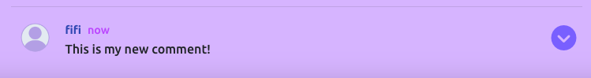
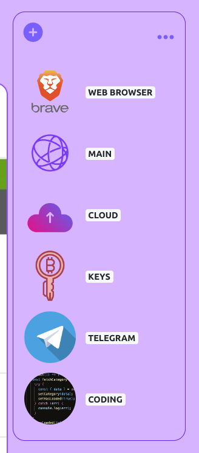

# Note

To enhance your reading experience of this documentation, we recommend not using the dark mode of Github, as it may display images with distorted colors that do not accurately reflect reality.

# Purpose of this project

In today's digital world, we often struggle to locate important resources when we need them the most. Thankfully, we have a helpful tool called a screenshot, which enables us to capture and preserve a screen image of vital information or instant snapshots of a situation. If you have ever searched for an old email with critical address details, you can relate to the challenge of finding specific screenshots of this event from a massive collection of files with generic names on Desktop location. Sometimes, we may need to capture evidence of a non-working service or keep a record of changes made to a system. However, locating the right screenshot from hundreds of files can be time-consuming and frustrating. 


There have been many instances where I have needed an application that allows me to search for a specific screenshot using keywords. That is precisely what the Screenshot Organizer app does, and it is the focus of this document that I will be presenting.

Personal Note :

When editing a README file for a project, I always have a section called "Fixed bugs" where I'm supposed to list any bugs I encountered during the development of the app and explain how I solved them. However, it can be frustrating to recall a specific bug I had without the accompanying screenshots. That's an other reason I decided to developp this app, specifically for capturing these bugs and organize them. This way, I can easily find them later and save time searching through my desktop.


Analys of the main problem:

- Difficulty locating specific screenshots: With the abundance of digital features available, finding a particular screenshot from a vast collection of files with generic names can be challenging and time-consuming.

- Inefficient management of digital assets: The process of scrolling through hundreds of files to locate the right screenshot is not only frustrating but also inefficient. A dedicated app like Screenshot Organizer can help users better manage their digital assets and streamline their workflow.


This project was developed in order to demonstrate 
some ability to :
- code in Python
- deal with boostrap React
- manipulate REST Framework
- understand API
- build an App with Back-End and Front-end developpement
- code with ReactJS


[Front-End : Check this out!](https://screenshot-organizer-frontend.herokuapp.com/home)

[Back-End : Check this out!](https://screenshot-organizer-backend.herokuapp.com/)

[Back-End : Readme File](https://github.com/artontray/screenshot-backend/blob/main/README.md)


# Screenshot Organizer

Screenshots are a fascinating phenomenon in the digital age. They capture a stolen moment in time that only you can see on your computer screen, making it a unique piece of digital art. The ability to share this image with the rest of the world is a powerful concept that has the potential to inspire, provoke thought, or even make someone smile.

In a world where we are constantly bombarded with information, a screenshot can capture a specific moment that resonates with us in a personal way. It can evoke a range of emotions and stir up memories that we may have forgotten. It's a visual snapshot of our digital lives that we can choose to keep private or share with others.

The act of taking a screenshot is a form of creative expression, capturing an instant in time that can never be replicated. It's a reflection of who we are and the world we inhabit, offering a glimpse into our digital experiences.

So, whether it's a funny meme, a touching message from a loved one, or an inspirational quote, a screenshot has the power to bring people together and create a shared experience. It's a testament to the power of technology and a such of unique ways in which it allows us to connect and express ourselves.


# Contents

* [**User Experience UX**](<#user-experience-ux>)
    * [Wireframes](<#wireframes>)
    * [Structure of the app](<#structure-of-the-app>)
    * [Programming Structure](<#programming-structure>)
    * [Design Choices](<#design-choices>)
      -   [Typography](<#typography>)
      -   [Colour Scheme](<#colour-scheme>)
    * [User stories](<#user-stories>)
* [**Existing Features as a User**](<#existing-features-as-a-user>)
    * [Home Page](<#home-page>)
    * [Navigation](<#navigation>)
    * [Sign Up](<#sign-up>)
    * [Sign In](<#sign-in>)
    * [Sign Out](<#sign-out>)
    * [Edit Profile](<#edit-profile>)
    * [Display Public Screenshot](<#display-public-screenshot>)
    * [Likes](<#likes>)
    * [Comments](<#comments>)
    * [Dashboard](<#dashboard>)
    * [Public Screenshot](<#public-screenshot>)
    * [Private Screenshot](<#private-screenshot>)
    * [Users of the app](<#users-of-the-app>)
    * [Followers](<#followers>)
    * [Searching](<#searching>)
* [**Future Features of the app**](<#future-features-of-the-app>)
    * [A Zip](<#a-zip>)
    * [Screenshot Report](<#screenshot-report>)
    * [Pre-selection of avatars](<#pre-selection-of-avatars>)
    * [proof of activity](<#proof-of-activity>)
    * [share your link](<#share-your-link>)
    * [share category](<#share-category>)
    * [Blur effect on screenshots](<#blur-effect-on-screenshots>)
* [**Technologies**](<#technologies>)
    * [Languages](<#languages>)
    * [Frameworks and Software](<#frameworks-and-software>)
    * [Libraries](<#libraries>)
    * [Tools](<#tools>)
* [**Testing**](<#testing>)    
    * [User Story Testing](#user-story-testing)
    * [Validator HTML CSS JAVASCRIPT](#validator-html-css-javascript)
      * [HTML](#html)
      * [CSS](#css)
      * [javascript](#javascript)
    * [Lighthouse](#lighthouse)
    * [Color Contrast Accessibility Validator](#color-contrast-accessibility-validator)
    * [Browser Testing](#browser-testing)
    * [Responsiveness Test](#responsiveness-test)
    * [Browser Compatibility](#browser-compatibility)
    * [Manual Testing](#manual-testing)
      * [Site Navigation](#site-navigation)
      * [Manual Testing](#manual-testing)
    * [Form Validation](#form-validation)
    * [Error pages](#error-pages)
    * [Bugs](#bugs)
* [**Deployment**](#deployment)
* [**Credits**](<#credits>)
    * [**Content And Media**](<#content-and-media>)
    * [**Best part of this project**](<#best-part-of-this-project>)
*  [**Acknowledgements**](<#acknowledgements>)


    

# User Experience (UX)

## Wireframes

I utilized [Balsamiq](https://balsamiq.com/learn/) to visually represent my ideas. From the outset, my goal was to design an efficient App that presents all crucial information in an aesthetically pleasing manner.

Main focus was :
- Community informations and fluent navigation
- Category-Folder as a main product to organize Users Private Screenshots
- Searching tasks on the App should be easy and efficient


this is the final result of the dashboard with category Menu :


[Back to top](<#contents>)

## Structure of the App

The App is divided in several parts :

- Authentification and New user's registration
- Public Area : All screenshots published are available for anybody connected or not of the app
- A community aspect where every user can follow and be followed by others 
- A likes and comments features to dynamize the app with user interactions
- Private Area : The User will have access to a dedicated area where is possible to create Category (Folders) and private screenshots

A screenshot from Public Area looks like the following :


A screenshot from Private Area looks like the following :


[Back to top](<#contents>)

## Programming structure

As React works building components, the App is divided into differents components :


- Community Most followed Users (1)
- Search Bar (2)


- Category Quick Access (1)
- Infinite Scroll with all the screenshots displaying while scrolling (no pagination) (2)
- Category Details (3)
- NavBar (4)


And Even components inside other component.

The Select option fields is itself a component (2)


Once components created, they need to comunicate each other and display a Live Result without refreshing the page :


[Back to top](<#contents>)


## Design Choices

### Typography

I used the fantastic website of  [React bootstrap](https://react-bootstrap.netlify.app/) to get the code i needed to create the structure of the app and each components skeleton. 

I used also this page [This page](https://react-bootstrap.netlify.app/components/alerts/)  to grab components skeleton i needed.


About the font : 

I tried Bebas Neue, Delius, EB Garamond, and Playfair Display, but [Ubuntu](https://fonts.google.com/specimen/Ubuntu) font caught my attention the most.

### Colour Scheme

Purple light scheme was for me a good choice for several reasons:

**Uniqueness**: Purple is a less common color used in website design, so it can make your website stand out from others.

**Creativity**: Purple is often associated with creativity, imagination, and inspiration. If your website focuses on art, design, or any creative field, using purple can help to reinforce these themes.

**Elegance**: Purple is also associated with luxury, sophistication, and royalty. If your website is for a high-end brand or product, using purple can help to convey an elegant and exclusive feel.

**Versatility**: Purple is a versatile color that can be used in many different shades and tones. From deep, rich purples to lighter lavender hues, there are many options to choose from when designing a color scheme.

**Gender-Neutral**: Purple is often seen as a gender-neutral color, making it a good choice for websites that want to appeal to a diverse audience.

The following colors have been used in the App :

-  `#dab3ff`
-  `#6600ff`
-  `#5a1eff`
-  `#7958ff`


[Back to top](<#contents>)


### User stories


First Time Visitor Goals :
| Story | action required | Checked? |
|:-------:|:--------|:--------|
| As a first time visit | I want to understand the main purpose of the app | &check; |
| As a first time visit | I want to understand how to register and how to connect to the app | &check; |


The user stories for the project are listed below to clarify the significance of specific features.

### Site User
| Story | action required | Checked? |
|:-------:|:--------|:--------|
| As a Unlogged User | I can sign up to the App | &check; |
| As a Unlogged User | I can acces to home page where i can find informations about what is the app about | &check; |
| As a Unlogged User | I can have access to all new screenshot published by users from the app | &check; |
| As a Site User | I can access the home page, where I will discover the purpose of the application and the proposed solution to the specific problem. | &check; |
| As a Site User | I can Register as a new user of the App. If already registered, I can log in and log out | &check; |
| As a Site User | I can edit my profile as Avatar, Username or password | &check; |
| As a Site User | I can see other user's profiles | &check; |
| As a Site User | I can follow or Unfollow other Users | &check; |
| As a Site User | I can see information about how many followers I have, how many Users I follow, how many Private and Public screenshot I published | &check; |
| As a Site User | I can like or comment a screenshot from other users | &check; |
| As a Site User | I have a direct access to all the screenshots I liked from other Users | &check; |
| As a Site User | I have direct access to all screenshots from all the followed Users I am following | &check; |
| As a Site User | I have a direct access to All the new Public screenshots published on the app organized by date | &check; |
| As a Site User | I can search for a specific screenshot or a User with key words in 3 differents areas : My favorites screenshots, My favorites users and in New screenshots area| &check; |
| As a Site User | I have a direct access to all most followed Users of the app | &check; |
| As a Site User | I can Unlike a Public Screenshot from other User | &check; |
| As a Site User | I cannot like one of my own Public Screenshot | &check; |
| As a Site User | I can comment other Public screenshot and also my own Public screenshot.| &check; |
| As a Site User | I can edit my comments at any time and the updated comment is published right away. | &check; |
| As a Site User | I can delete a comment I made on a Public screenshot.| &check; |
| As a Site User | I can have access to a page dedicated for adding new content : Public screenshot, Private screenshot or a new category | &check; |
| As a Site User | I can add a new category, it's a folder-like feature to help organizing private screenshots | &check; |
| As a Site User |  I can add a new Private screenshot, I can choose on same page into which category it will be added | &check; |
| As a Site User | I can add a new Public screenshot and publish it so anybody on the app, even unlogged user can see it. | &check; |

| As a Site User | I can have access to a Dashboard where i can see all my category folders, all my privateScreenshot | &check; |
| As a Site User | I can add new category, update category and delete category. At least one category should remain for adding Screenshot as a requirement | &check; |
| As a Site User | I can add new private screenshot, update it, delete it | &check; |
| As a Site User | I can add a new Public Screenshot, update it and delete it. | &check; |
| As a Site User | I can search to any key words into category, Private screenshot and description of both in the same searchBar | &check; |
| As a Site User | I can access to a dedicated page to see all my category folder and see avatar of each and how much screenshots are published inside | &check; |
| As a Site User | I have a fluent navigation within cancel button, Back button or dropdownMenu for quick selection | &check; |
| As a Site User | I can see a dedicated page 404 when URL incoporated is wrong and I have access to a button to get me back safe to the app
 | &check; |

The completion of each User Story is made clear through the defined acceptance criteria :
- Must have
- Should have
- Wont have

I used Github to manage the different user stories tasks :

2. milestones :
- current sprint
- Future Features sprint


[Back to top](<#contents>)

# Existing Features as a User

## Navigation

When discovering the app for very first time, a User have access to home page which is a dedicated page for user to understand the purpose of the app.


 Then, you can access to "Sign In" button or a "Sign Up" button :


If User click on Register button, User will have access to a registration Form  :


If User click on "Sign In" button, User will have access to a Connection Form  :


When a user is logged in, User have access to the following resources:

- Profile: The user has access to all information related to their account, including their stats (Private/Public screenshots amount, Avatar, followers, following and a DropDown Button to Edit, update information as avatar, username or password)


- New : User can create a New Public screenshot, a Private Screenshot or a new category
- Favorites: This area will show only Public screenshots from followed Users.
- Community Area: The user can view all most followed users of the app and perform a search for a specific user.
- Dashboard: A dashboard for the user to manage category and content.
- News: The user can view all the newest Public screenshots published on the app, including their own and those of other users. They also have the ability to search for a specific screenshot.

- Logout : This button allow to a connected User to log out from the app.


[Back to top](<#contents>)


## Sign Up

When a User decide to Register to the app, it will happen the following :
- If Registration form is correctly filled then :
  * Auto-Redirection to Log in page.


When registered, User will have access to one catgegory already created :


[Back to top](<#contents>)


## Sign In

When a User enter the App with a existing username and correct password, it will happen the following :

- The NavBar appear with full possibilities :  Profile, Dashboard, News, Dashboard etc..


[Back to top](<#contents>)


## Sign Out

When a User click on Logout button, User will be disconnect to the App and it will result having unlogged User status.


## Edit Profile

User can Edit Profile anytime and as many time as User wants.

For that, click on the button top-right of profile box to make appears an DropDown Box with "Edit profile" ,"Change username" and "Change password" :


A form will appears :


Here User can edit Bio and Avatar.


User can also change username :


and password:


[Back to top](<#contents>)


## Display Public Screenshot


Regarding the back-end configuration, we have established the PAGINATION_SIZE to be 10. This implies that whenever we retrieve a list of data from the database, only 10 results will be visible at a time. In order to display additional results, it would be necessary to utilize a while loop and send a request for each page of results.
```
 while(condition){
  page++;
  const requete  = await axiosReq.get(`/category/?page=${page}`);
  ....
  ....
 }
```


```
REST_FRAMEWORK = {
    'DEFAULT_AUTHENTICATION_CLASSES': [(
        'rest_framework.authentication.SessionAuthentication'
        if 'DEV' in os.environ
        else 'dj_rest_auth.jwt_auth.JWTCookieAuthentication'
    )],
    'DEFAULT_PAGINATION_CLASS':
        'rest_framework.pagination.PageNumberPagination',
    'PAGE_SIZE': 10,
    'DATETIME_FORMAT': '%d %b %Y',
}
```

Instead, I will use the InfiniteScroll component :

```
<InfiniteScroll
  children={scrshots.results.map((scrshot) => (
    <ScrshotPublic key={scrshot.id} {...scrshot} setScrshots={setScrshots} />
  ))}
  dataLength={scrshots.results.length}
  loader={<Asset spinner />}
  hasMore={!!scrshots.next}
  next={() => fetchMoreData(scrshots, setScrshots)}
/>
```
imported as followed :
```
import InfiniteScroll from "react-infinite-scroll-component";
```

By implementing this, an infinite scrolling effect will be created, where all of the results will not be loaded simultaneously. Instead, screenshots will be loaded progressively as the user scrolls down the page. As a result, the user will remain on the same page and will not be required to navigate through pagination page buttons.

[Back to top](<#contents>)


## Likes

Within the public area of the application, we have incorporated a "Likes" feature for screenshots. The reason for this is quite simple: as the user scrolls through and views numerous screenshots, Users may come across one that they wish to save for future reference. By clicking on the "Likes" button, the post will be saved to a designated area where the user can easily access and view all of their favorite published screenshots.


[Back to top](<#contents>)


## Comments

All logged-in users, including the owner of the screenshot, are able to provide comments on any public screenshot. To enhance user experience, we have utilized once again InfiniteScroll component to display comments while scrolling through the screenshots.


```
 <InfiniteScroll
  children={comments.results.map((comment) => (
    <Comment
      key={comment.id}
      {...comment}
      setScrshot={setScrshot}
      setComments={setComments}
    />
  ))}
  dataLength={comments.results.length}
  loader={<Asset spinner />}
  hasMore={!!comments.next}
  next={() => fetchMoreData(comments, setComments)}
/>
```
The textarea input for adding a new comment is displayed just under a screenshot.


When posted, comments appears like this :



On clicking on the right icon, it will display a menu for Editing comment or Delete comment.


Once edited, the comment is published directly.


[Back to top](<#contents>)


## Dashboard

The central component of the App is the Dashboard menu, which allows logged-in users to create new categories and store private screenshots within them. This approach effectively highlights the app's advantages. By using this feature, users can easily access important information such as event submissions, bank deposits, conversations with friends, significant emails, online news articles, and many other use cases. These categories help users keep their screenshots organized and easily accessible when needed.




[Back to top](<#contents>)


## Public Screenshot

A public screenshot refers to an image or a gif with a maximum size of 2Mb that users can share with the world. When published, it will appear as the first item in the News Area. If the user is the owner of the public screenshot, a small icon will appear at the top-right corner, allowing the user to edit or delete the screenshot. 


A Public screenshot can been liked (not by owner) and commented.


[Back to top](<#contents>)

## Private Screenshot

A Private Screenshot is an image or gif with a maximum size of 2Mb that users can save in a specific category, similar to a folder concept. After creating a category, users can add new screenshots to it or change the screenshot to a different category at any time. Other users or the owner cannot comment or like a private screenshot. If the user wants to add additional information to a private screenshot, they can use the edit button and include the extra details in the screenshot's description.


To identify a Private screenshot, a Lock Icon is displayed on top-left on each Private screenshot.


[Back to top](<#contents>)

## Users of the app

This kind of app is dedicated to have thousands of users and there was no way to display them all in one page so a menu on the right side ahs been created to show off 10 (Pagination remember) most followed users.
