# Note

To enhance your reading experience of this documentation, we recommend not using the dark mode of Github, as it may display images with distorted colors that do not accurately reflect reality.

# Purpose of this project

In today's digital world, we often struggle to locate important resources when we need them the most. Thankfully, we have a helpful tool called a screenshot, which enables us to capture and preserve a screen image of vital information or instant snapshots of a situation. If you have ever searched for an old email with critical address details, you can relate to the challenge of finding specific screenshots of this event from a massive collection of files with generic names on Desktop location. Sometimes, we may need to capture evidence of a non-working service or keep a record of changes made to a system. However, locating the right screenshot from hundreds of files can be time-consuming and frustrating. 


There have been many instances where I have needed an application that allows me to search for a specific screenshot using keywords. That is precisely what the Screenshot Organizer app does, and it is the focus of this document that I will be presenting.

Personal Note :

When editing a README file for a project, I always have a section called "Fixed bugs" where I'm supposed to list any bugs I encountered during the development of the app and explain how I solved them. However, it can be frustrating to recall a specific bug I had without the accompanying screenshots. That's an other reason I decided to developp this app, specifically for capturing these bugs and organize them. This way, I can easily find them later and save time searching through my desktop.


Analys of the main problem:

- Difficulty locating specific screenshots: With the abundance of digital features available, finding a particular screenshot from a vast collection of files with generic names can be challenging and time-consuming.

- Inefficient management of digital assets: The process of scrolling through hundreds of files to locate the right screenshot is not only frustrating but also inefficient. A dedicated app like Screenshot Organizer can help users better manage their digital assets and streamline their workflow.


This project was developed in order to demonstrate 
some ability to :
- code in Python
- deal with boostrap React
- manipulate REST Framework
- understand API
- build an App with Back-End and Front-end developpement
- code with ReactJS


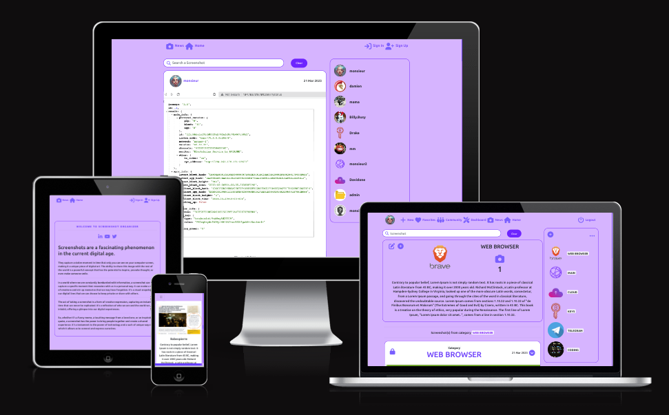


[Front-End : Check this out!](https://screenshot-organizer-frontend.herokuapp.com/home)

[Back-End : Check this out!](https://screenshot-organizer-backend.herokuapp.com/)

[Back-End : Readme File](https://github.com/artontray/screenshot-backend/blob/main/README.md)

* 31 issues have been created for this project : [Check it out](https://github.com/users/artontray/projects/6)


# Screenshot Organizer

Screenshots are a fascinating phenomenon in the digital age. They capture a stolen moment in time that only you can see on your computer screen, making it a unique piece of digital art. The ability to share this image with the rest of the world is a powerful concept that has the potential to inspire, provoke thought, or even make someone smile.

In a world where we are constantly bombarded with information, a screenshot can capture a specific moment that resonates with us in a personal way. It can evoke a range of emotions and stir up memories that we may have forgotten. It's a visual snapshot of our digital lives that we can choose to keep private or share with others.

The act of taking a screenshot is a form of creative expression, capturing an instant in time that can never be replicated. It's a reflection of who we are and the world we inhabit, offering a glimpse into our digital experiences.

So, whether it's a funny meme, a touching message from a loved one, or an inspirational quote, a screenshot has the power to bring people together and create a shared experience. It's a testament to the power of technology and a such of unique ways in which it allows us to connect and express ourselves.


# Contents

* [**User Experience UX**](<#user-experience-ux>)
    * [Wireframes](<#wireframes>)
    * [Structure of the app](<#structure-of-the-app>)
    * [Programming Structure](<#programming-structure>)
    * [Design Choices](<#design-choices>)
      -   [Typography](<#typography>)
      -   [Colour Scheme](<#colour-scheme>)
    * [User stories](<#user-stories>)
* [**Existing Features as a User**](<#existing-features-as-a-user>)
    * [Home Page](<#home-page>)
    * [Navigation](<#navigation>)
    * [Sign Up](<#sign-up>)
    * [Sign In](<#sign-in>)
    * [Sign Out](<#sign-out>)
    * [Edit Profile](<#edit-profile>)
    * [Display Public Screenshot](<#display-public-screenshot>)
    * [Likes](<#likes>)
    * [Comments](<#comments>)
    * [Dashboard](<#dashboard>)
    * [Public Screenshot](<#public-screenshot>)
    * [Private Screenshot](<#private-screenshot>)
    * [Users of the app](<#users-of-the-app>)
    * [Searching](<#searching>)
    * [C.R.U.D functionality](<#C.R.U.D-functionality>)
* [**Future Features of the app**](<#future-features-of-the-app>)
    * [A Zip](<#a-zip>)
    * [Screenshot Report](<#screenshot-report>)
    * [Pre-selection of avatars](<#pre-selection-of-avatars>)
    * [proof of activity](<#proof-of-activity>)
    * [share your link](<#share-your-link>)
    * [share category](<#share-category>)
    * [Blur effect on screenshots](<#blur-effect-on-screenshots>)
    * [Are you human?](<#are-you-human?>)
* [**Technologies**](<#technologies>)
    * [Languages](<#languages>)
    * [Frameworks and Software](<#frameworks-and-software>)
    * [Libraries](<#libraries>)
    * [Tools](<#tools>)
* [**Testing**](<#testing>)    
    * [User Story Testing](#user-story-testing)
    * [Validator HTML CSS JAVASCRIPT](#validator-html-css-javascript)
      * [HTML](#html)
      * [CSS](#css)
    * [Lighthouse](#lighthouse)
    * [Color Contrast Accessibility Validator](#color-contrast-accessibility-validator)
    * [Browser Testing](#browser-testing)
    * [Responsiveness Test](#responsiveness-test)
    * [Browser Compatibility](#browser-compatibility)
    * [Manual Testing](#manual-testing)
      * [Site Navigation](#site-navigation)
      * [Manual Testing](#manual-testing)
    * [Form Validation](#form-validation)
    * [Error pages](#error-pages)
    * [Bugs](#bugs)
* [**Deployment**](#deployment)
* [**Credits**](<#credits>)
    * [**Content And Media**](<#content-and-media>)
    * [**Best part of this project**](<#best-part-of-this-project>)
*  [**Acknowledgements**](<#acknowledgements>)


    

# User Experience (UX)

## Wireframes

I utilized [Balsamiq](https://balsamiq.com/learn/) to visually represent my ideas. From the outset, my goal was to design an efficient App that presents all crucial information in an aesthetically pleasing manner.

Main focus was :
- Community informations and fluent navigation
- Category-Folder as a main product to organize Users Private Screenshots
- Searching tasks on the App should be easy and efficient

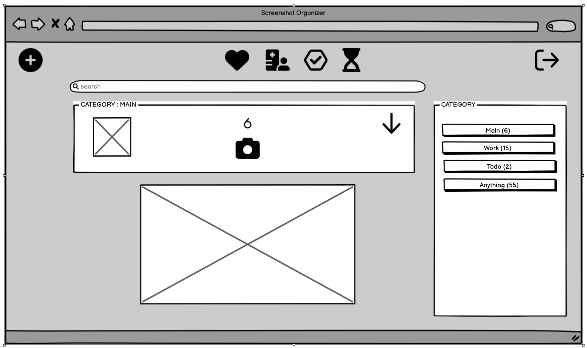

this is the final result of the dashboard with category Menu :

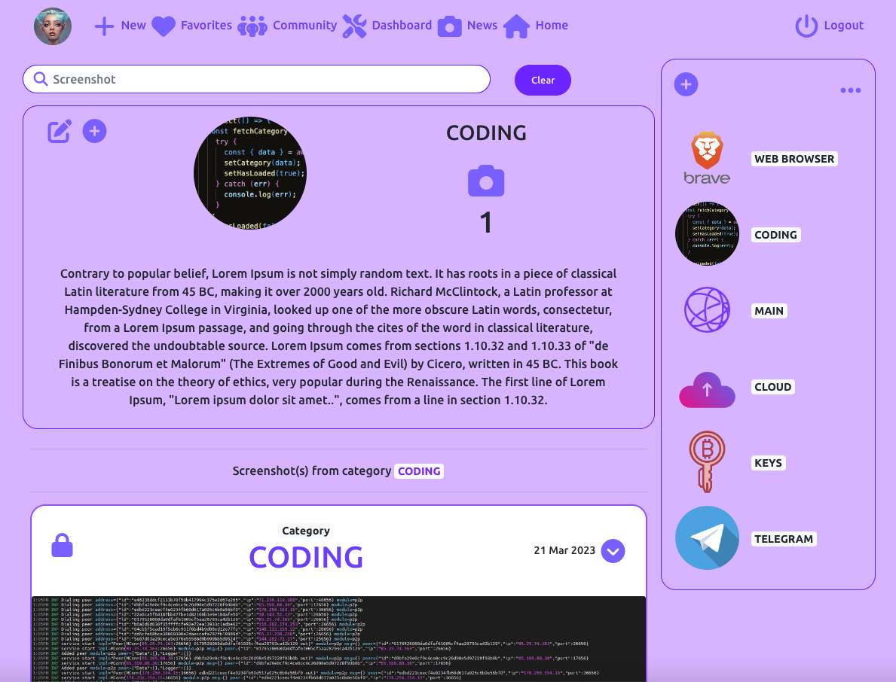

[Back to top](<#contents>)

## Structure of the App

The App is divided in several parts :

- Authentification and New user's registration
- Public Area : All screenshots published are available for anybody connected or not
- A community aspect where every user can follow and be followed by others 
- A likes and comments features to dynamize the app with user interactions
- Private Area : The User will have access to a dedicated area where is possible to create Category (Folders) and private screenshots

A screenshot from Public Area looks like the following :


A screenshot from Private Area looks like the following :

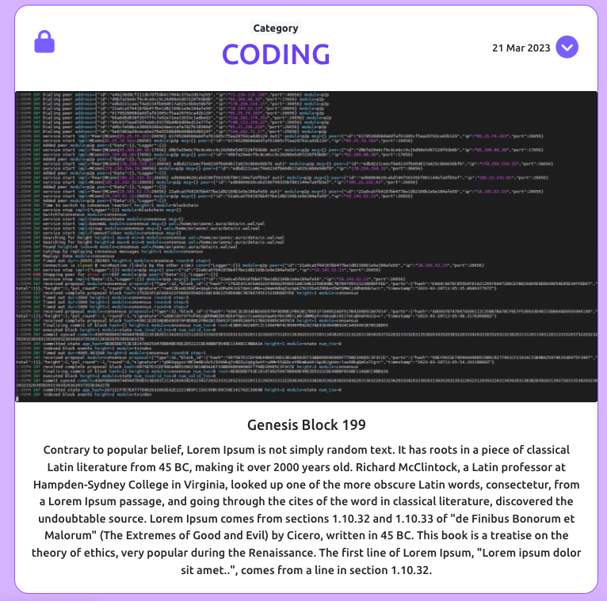

[Back to top](<#contents>)

## Programming structure

As React works building components, the App is divided into differents components :


- Community Most followed Users (1)
- Search Bar (2)


- Category Quick Access (1)
- Infinite Scroll with all the screenshots displaying while scrolling (no pagination) (2)
- Category Details (3)
- NavBar (4)

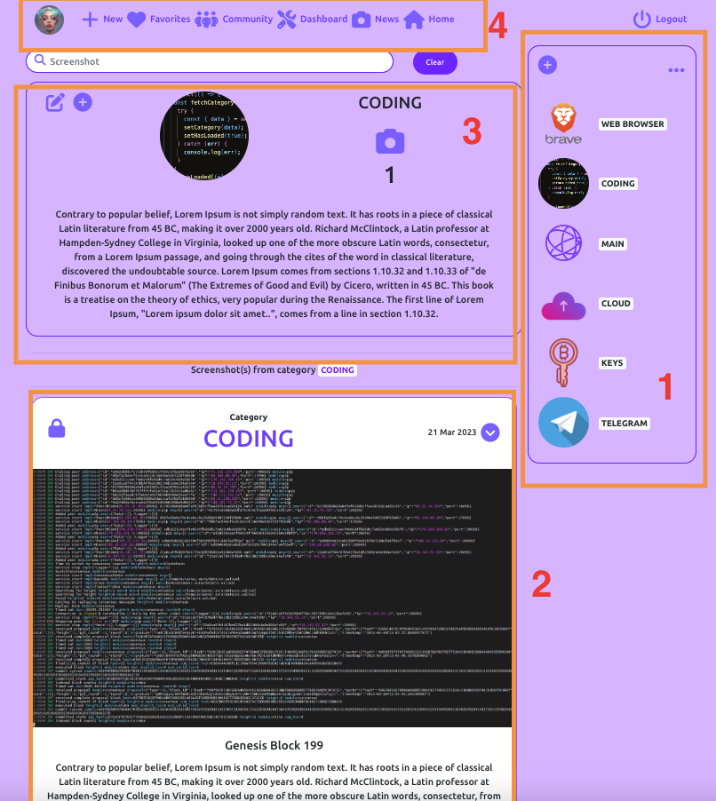

And Even components inside other component.

The Select option fields is itself a component (2)

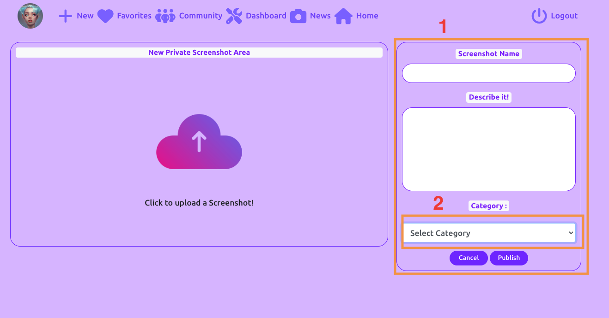

Once components created, they need to comunicate each other and display a Live Result without refreshing the page :

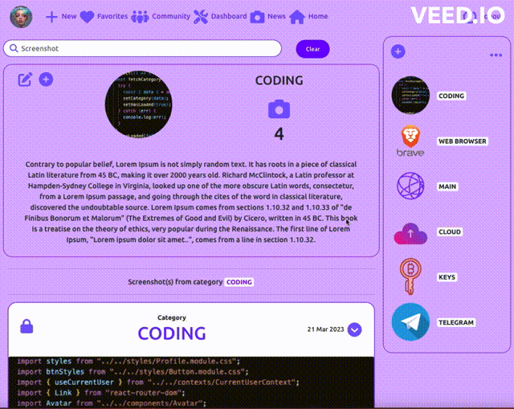

[Back to top](<#contents>)


## Design Choices

### Typography

I used the fantastic website of  [React bootstrap](https://react-bootstrap.netlify.app/) to get the code i needed to create the structure of the app and each components skeleton. 

I used also this page [This page](https://react-bootstrap.netlify.app/components/alerts/)  to grab components skeleton i needed.


About the font : 

I tried Bebas Neue, Delius, EB Garamond, and Playfair Display, but [Ubuntu](https://fonts.google.com/specimen/Ubuntu) font caught my attention the most.

### Colour Scheme

Purple light scheme was for me a good choice for several reasons:

**Uniqueness**: Purple is a less common color used in website design, so it can make your website stand out from others.

**Creativity**: Purple is often associated with creativity, imagination, and inspiration. If your website focuses on art, design, or any creative field, using purple can help to reinforce these themes.

**Elegance**: Purple is also associated with luxury, sophistication, and royalty. If your website is for a high-end brand or product, using purple can help to convey an elegant and exclusive feel.

**Versatility**: Purple is a versatile color that can be used in many different shades and tones. From deep, rich purples to lighter lavender hues, there are many options to choose from when designing a color scheme.

**Gender-Neutral**: Purple is often seen as a gender-neutral color, making it a good choice for websites that want to appeal to a diverse audience.

The following colors have been used in the App :

-  `#dab3ff`
-  `#6600ff`
-  `#5a1eff`
-  `#7958ff`


[Back to top](<#contents>)


### User stories


First Time Visitor Goals :
| Story | action required | Checked? |
|:-------:|:--------|:--------|
| As a first time visit | I want to understand the main purpose of the app | &check; |
| As a first time visit | I want to understand how to register and how to connect to the app | &check; |


The user stories for the project are listed below to clarify the significance of specific features.

### Site User
| Story | action required | Checked? |
|:-------:|:--------|:--------|
| As a Unlogged User | I can sign up to the App | &check; |
| As a Unlogged User | I can acces to home page where i can find informations about what is the app about | &check; |
| As a Unlogged User | I can have access to all new screenshot published by users from the app | &check; |
| As a Site User | I can access the home page, where I will discover the purpose of the application and the proposed solution to the specific problem. | &check; |
| As a Site User | I can Register as a new user of the App. If already registered, I can log in and log out | &check; |
| As a Site User | I can edit my profile as Avatar, Username or password | &check; |
| As a Site User | I can see other user's profiles | &check; |
| As a Site User | I can follow or Unfollow other Users | &check; |
| As a Site User | I can see information about how many followers I have, how many Users I follow, how many Private and Public screenshot I published | &check; |
| As a Site User | I can like or comment a screenshot from other users | &check; |
| As a Site User | I have a direct access to all the screenshots I liked from other Users | &check; |
| As a Site User | I have direct access to all screenshots from all the followed Users I am following | &check; |
| As a Site User | I have a direct access to All the new Public screenshots published on the app organized by date | &check; |
| As a Site User | I can search for a specific screenshot or a User with key words in 3 differents areas : My favorites screenshots, My favorites users and in New screenshots area| &check; |
| As a Site User | I have a direct access to all most followed Users of the app | &check; |
| As a Site User | I can Unlike a Public Screenshot from other User | &check; |
| As a Site User | I cannot like one of my own Public Screenshot | &check; |
| As a Site User | I can comment other Public screenshot and also my own Public screenshot.| &check; |
| As a Site User | I can edit my comments at any time and the updated comment is published right away. | &check; |
| As a Site User | I can delete a comment I made on a Public screenshot.| &check; |
| As a Site User | I can have access to a page dedicated for adding new content : Public screenshot, Private screenshot or a new category | &check; |
| As a Site User | I can add a new category, it's a folder-like feature to help organizing private screenshots | &check; |
| As a Site User | I can add a new Private screenshot, I can choose on same page into which category it will be added | &check; |
| As a Site User | I can add a new Public screenshot and publish it so anybody on the app, even unlogged user can see it. | &check; |
| As a Site User | I can have access to a Dashboard where i can see all my category folders and all my private Screenshots | &check; |
| As a Site User | I can add new category, update category and delete category. At least one category should remain for adding Screenshot as a requirement | &check; |
| As a Site User | I can add new private screenshot, update it, delete it | &check; |
| As a Site User | I can add a new Public Screenshot, update it and delete it. | &check; |
| As a Site User | I can search to any key words into category and Private screenshot | &check; |
| As a Site User | I can access to a dedicated page to see all my category folder and see avatar of each and how much screenshots are published inside | &check; |
| As a Site User | I have a fluent navigation within cancel button, Back button or dropdownMenu for quick selection | &check; |
| As a Site User | I can see a dedicated page 404 when URL incoporated is wrong and I have access to a button to get me back safe to the app| &check; |

The completion of each User Story is made clear through the defined acceptance criteria :
- Must have
- Should have
- Wont have

I used Github to manage the different user stories tasks :

2. milestones :
- current sprint
- Future Features sprint


[Back to top](<#contents>)

# Existing Features as a User

## Navigation

When discovering the app for very first time, a User have access to home page which is a dedicated page for user to understand the purpose of the app.


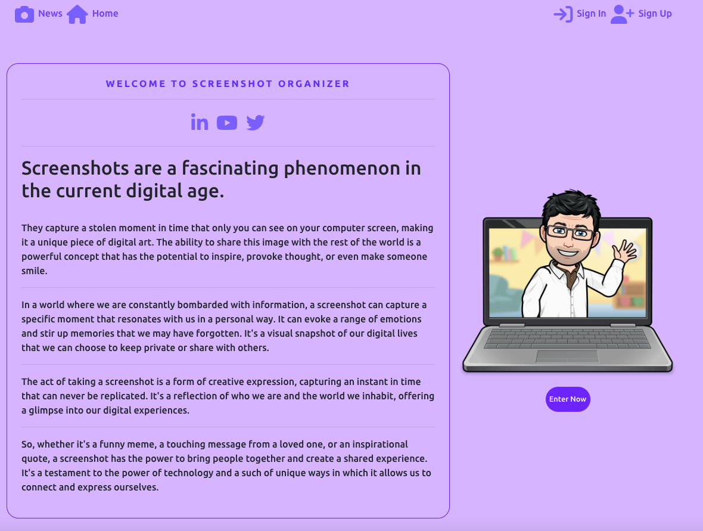


 Then, you can access to "Sign In" button or a "Sign Up" button :

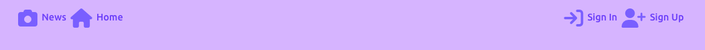

If User click on Register button, User will have access to a registration Form  :

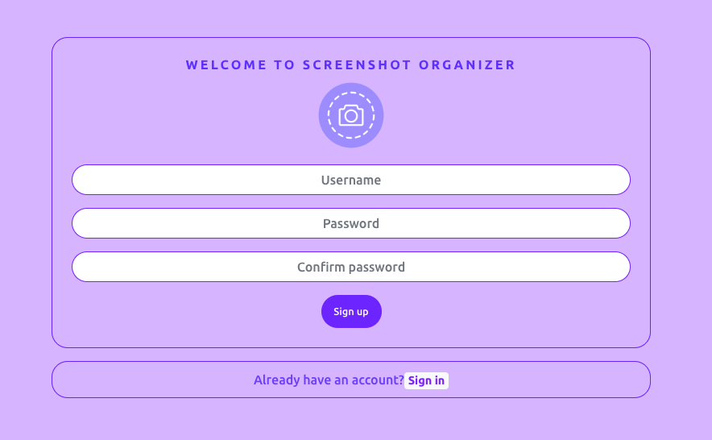


If User click on "Sign In" button, User will have access to a Connection Form  :


When a user is logged in, User have access to the following resources:

- Profile: The user has access to all information related to their account, including their stats (Private/Public screenshots amount, Avatar, followers, following and a DropDown Button to Edit, update information as avatar, username or password)


- New : User can create a New Public screenshot, a Private Screenshot or a new category
- Favorites: This area will show only Public screenshots from followed Users.
- Community Area: The user can view all most followed users of the app and perform a search for a specific user.
- Dashboard: A dashboard for the user to manage category and content.
- News: The user can view all the newest Public screenshots published on the app, including their own and those of other users. They also have the ability to search for a specific screenshot.

- Logout : This button allow to a connected User to log out from the app.

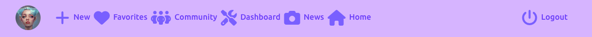


[Back to top](<#contents>)


## Sign Up

When a User decide to Register to the app, it will happen the following :
- If Registration form is correctly filled then :
  * Auto-Redirection to Log in page.


When registered, User will have access to one catgegory already created :


[Back to top](<#contents>)


## Sign In

When a User enter the App with a existing username and correct password, it will happen the following :

- The NavBar appear with full possibilities :  Profile, Dashboard, News, Dashboard etc..


[Back to top](<#contents>)


## Sign Out

When a User click on Logout button, User will be disconnect to the App and it will result having unlogged User status.


## Edit Profile

User can Edit Profile anytime and as many time as User wants.

For that, click on the button top-right of profile box to make appears an DropDown Box with "Edit profile" ,"Change username" and "Change password" :

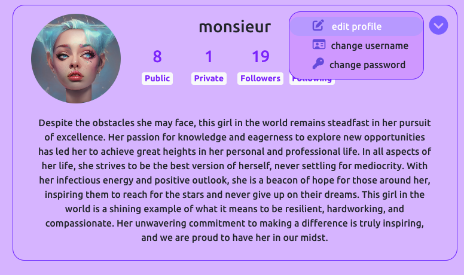

A form will appears :


Here User can edit Bio and Avatar.


User can also change username :

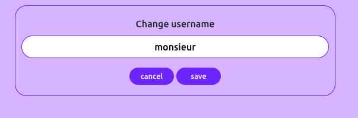

and password:


[Back to top](<#contents>)


## Display Public Screenshot


Regarding the back-end configuration, we have established the PAGINATION_SIZE to be 10. This implies that whenever we retrieve a list of data from the database, only 10 results will be visible at a time. In order to display additional results, it would be necessary to utilize a while loop and send a request for each page of results.
```
 while(condition){
  page++;
  const requete  = await axiosReq.get(`/category/?page=${page}`);
  ....
  ....
 }
```


```
REST_FRAMEWORK = {
    'DEFAULT_AUTHENTICATION_CLASSES': [(
        'rest_framework.authentication.SessionAuthentication'
        if 'DEV' in os.environ
        else 'dj_rest_auth.jwt_auth.JWTCookieAuthentication'
    )],
    'DEFAULT_PAGINATION_CLASS':
        'rest_framework.pagination.PageNumberPagination',
    'PAGE_SIZE': 10,
    'DATETIME_FORMAT': '%d %b %Y',
}
```

Instead, I will use the InfiniteScroll component :

```
<InfiniteScroll
  children={scrshots.results.map((scrshot) => (
    <ScrshotPublic key={scrshot.id} {...scrshot} setScrshots={setScrshots} />
  ))}
  dataLength={scrshots.results.length}
  loader={<Asset spinner />}
  hasMore={!!scrshots.next}
  next={() => fetchMoreData(scrshots, setScrshots)}
/>
```
imported as followed :
```
import InfiniteScroll from "react-infinite-scroll-component";
```

By implementing this, an infinite scrolling effect will be created, where all of the results will not be loaded simultaneously. Instead, screenshots will be loaded progressively as the user scrolls down the page. As a result, the user will remain on the same page and will not be required to navigate through pagination page buttons.

[Back to top](<#contents>)


## Likes

Within the public area of the application, we have incorporated a "Likes" feature for screenshots. The reason for this is quite simple: as the user scrolls through and views numerous screenshots, Users may come across one that they wish to save for future reference. By clicking on the "Likes" button, the post will be saved to a designated area where the user can easily access and view all of their favorite published screenshots.

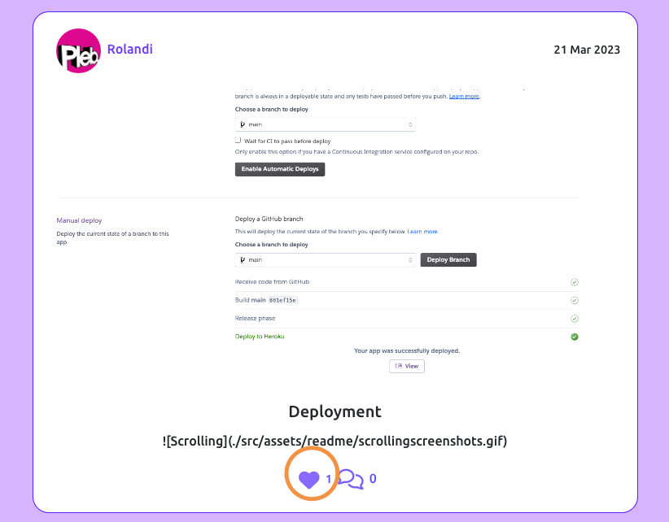


[Back to top](<#contents>)


## Comments

All logged-in users, including the owner of the screenshot, are able to provide comments on any public screenshot. To enhance user experience, we have utilized once again InfiniteScroll component to display comments while scrolling through the screenshots.


```
 <InfiniteScroll
  children={comments.results.map((comment) => (
    <Comment
      key={comment.id}
      {...comment}
      setScrshot={setScrshot}
      setComments={setComments}
    />
  ))}
  dataLength={comments.results.length}
  loader={<Asset spinner />}
  hasMore={!!comments.next}
  next={() => fetchMoreData(comments, setComments)}
/>
```
The textarea input for adding a new comment is displayed just under a screenshot.


When posted, comments appears like this :


On clicking on the right icon, it will display a menu for Editing comment or Delete comment.


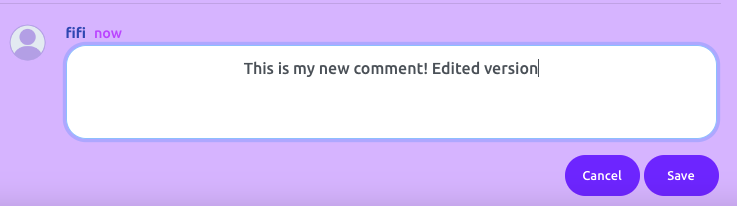

Once edited, the comment is published directly.

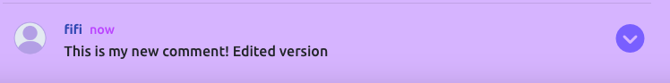


[Back to top](<#contents>)


## Dashboard

The central component of the App is the Dashboard menu, which allows logged-in users to create new categories and store private screenshots within them. This approach effectively highlights the app's advantages. By using this feature, users can easily access important information such as event submissions, bank deposits, conversations with friends, significant emails, online news articles, and many other use cases. These categories help users keep their screenshots organized and easily accessible when needed.


[Back to top](<#contents>)


## Public Screenshot

A public screenshot refers to an image or a gif with a maximum size of 2Mb that users can share with the world. When published, it will appear as the first item in the News Area. If the user is the owner of the public screenshot, a small icon will appear at the top-right corner, allowing the user to edit or delete the screenshot. 


A Public screenshot can been liked (not by owner) and commented.


[Back to top](<#contents>)

## Private Screenshot

A Private Screenshot is an image or gif with a maximum size of 2Mb that users can save in a specific category, similar to a folder concept. After creating a category, users can add new screenshots to it or change the screenshot to a different category at any time. Other users or the owner cannot comment or like a private screenshot. If the user wants to add additional information to a private screenshot, they can use the edit button and include the extra details in the screenshot's description.

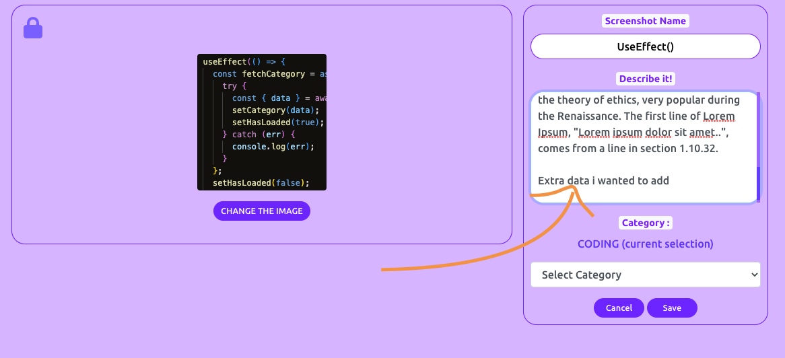

To identify a Private screenshot, a Lock Icon is displayed on top-left on each Private screenshot.

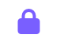

[Back to top](<#contents>)

## Users of the app

This kind of app is dedicated to have thousands of users and there was no way to display them all in one dedicated page so a menu on the right side has been created to show off 10 (Pagination setting remember?) most followed users.
Of course, within the news button, a user can discover new users and follow them.

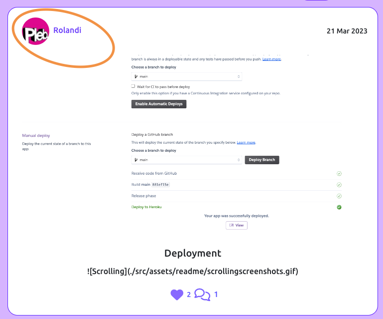

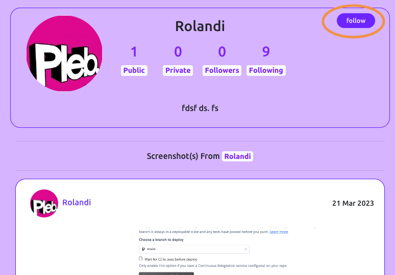

[Back to top](<#contents>)

## Searching

My goal was to design a highly efficient tool for researching within the app. Users can enter keywords in a single input field, and by simply clicking on "Community," "News," or "Favorites," the search will be performed in the corresponding area. Additionally, a clear button is provided to allow users to initiate a new search.

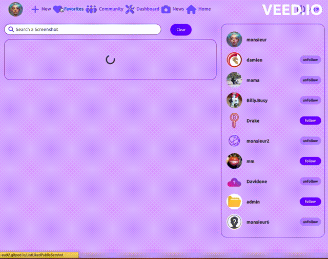


[Back to top](<#contents>)


## C.R.U.D functionality

In terms of CRUD functionality for this project, the following can be identified:

* Create: Users can create new public and private screenshots, categories, follow other users, add comments to public screenshots, like screenshots, and save them to their favorites.
* Read: Users can read all public screenshots when logged in, view comments on all public screenshots, and see the profile information of any displayed user, including their number of followers, followings, published private and public screenshots, and bio.
* Update: Users can update all their personal information and published content, such as their profile, password, username, public and private screenshots, categories, and bio.
* Delete: Users can delete all their published content, except for their profile, which cannot be deleted. Additionally, if a category is the only one available, it cannot be deleted.

[Back to top](<#contents>)

# Future Features of the app

## A Zip

One option available is to offer a zip file containing all the content within a particular category, which would allow users to create a secure backup of their private screenshots with just one click.

## Screenshot Report

Maintaining the integrity of the app is crucial for users, and the ability to interact with it is essential. In the event that a user publishes inappropriate content such as violence, racism, or sexual material, other users can report it, which would result in the image being hidden from the app until an administrator verifies the validity of the report.

## Pre-selection of avatars

In order to ensure that each category is easily identifiable to users, the app requires an image to be added as an avatar when a new category is created. I suggest implementing a pre-selection of avatars for common category names such as Work, Friends, Tickets, Bank, Conversations, Art, etc. This would allow users to easily choose the appropriate avatar from the pre-selection list rather than having to search for one on their own computer.

## proof of activity

To maintain the uniqueness of public screenshots, the app will verify whether the same image has already been published with a different user as the owner before a new public screenshot can be submitted. This is achieved by generating a proof of activity when a user submits a new public screenshot. By using the pixels of the image to create a hash, we can compare it with all the public screenshots on the app to ensure that no duplicates are being uploaded.

## share your link

The Private area is completely secure and inaccessible to any other users. Even if the owner were to share a link to a private screenshot, attempting to access it would result in a 404 error. However, we could offer users the option to share a private screenshot for a specified period of time, such as 1 hour, 1 day, or 1 week. Once the link is generated, any user with access to it would be able to view the image until the specified time period has elapsed.

## share category


Similar to the functionality offered by the [DropBox app](https://www.dropbox.com/), we could provide users with the ability to share a category with another user while assigning specific access rights such as Edit, Read, Delete, or Create. The shared category would be displayed in the right-side menu alongside the users' categories, but with a distinct design to clearly differentiate it. This feature would enable groups or teams to collaborate on a project and have access to the same source of images as everyone else in the group.

## Blur effect on screenshots

Certain public screenshots may contain highly sensitive information such as email addresses, names, addresses, and bank account details. To address this, we could offer a Blur function that allows users to apply a blur effect to specific parts of the image. The blurred image would then be uploaded to the cloud, and the original image would be deleted to ensure that no sensitive information is visible.

## Are you human?

To avoid robot adding thousands of images to spam the cloud, we could implement a "Are you a human" box. on the screenshot publishing pages.


[Back to top](<#contents>)

# Technologies

## Languages
- JavaScript
- HTML
- JSX
- CSS


[Back to top](<#contents>)

## Frameworks and Software

I have been using the following Frameworks and Software :

- Balsamiq - wireframes creation. 
- React.js - Dynamic behaviour of the App
- React Bootstrap.js - library of components.
- GitHub - hosting of the project folders.
- GitPod - Workspace and coding space.
- Heroku -  Assure the final Deployment 
- [AmIResponsive](https://ui.dev/amiresponsive) - Display responsiveness of the App
- [Favicon](https://favicon.io/) - Generate favicon icons.
- [FontAwesome](https://fontawesome.com/) - Icons used everywhere on the App
- [GoogleFonts](https://fonts.google.com/) -  To find the perfect font for the App.
- [Veed.io](https://veed.io/) -  Generate Gif from short videos
- [AmIResponsive](https://ui.dev/amiresponsive) -  Responsive display of the app
- [HTML Validator](https://validator.w3.org/) -  HTML Validator
- [CSS Validator](https://jigsaw.w3.org/css-validator/) -  CSS Validator
- [Lighthouse Testing](https://pagespeed.web.dev/) -  Lighthouse testing
- [Color and contrast testing](https://color.a11y.com/Contrast/) -  Color and contrast testing


[Back to top](<#contents>)

# Testing

## User Story Testing


| Story | action required | Checked? |
|:-------:|:--------|:--------|
| As a Unlogged User | I can sign up to the App | &check; |

When unlogged User click on Sign up button, it will be redirected to a sign up form to fill in.


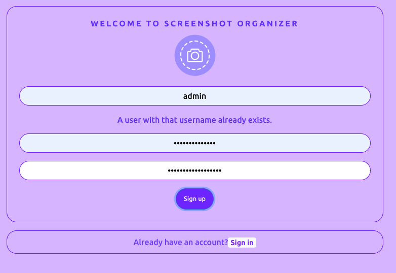

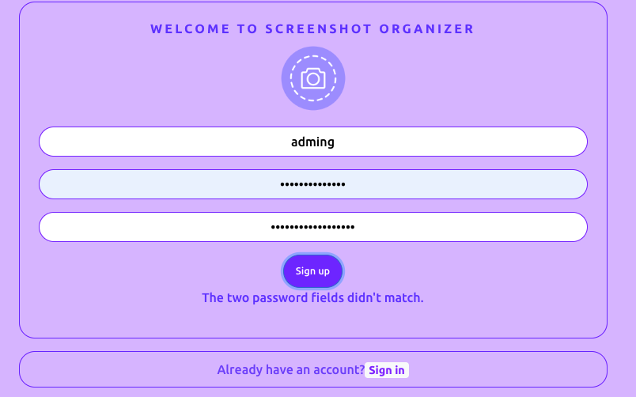

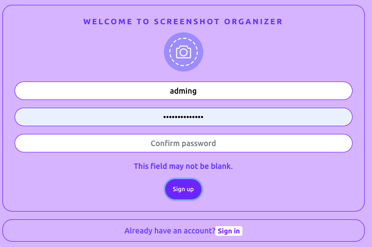

| Story | action required | Checked? |
|:-------:|:--------|:--------|
| As a Unlogged User | I can acces to home page where i can find informations about what is the app about | &check; |

On clicking on the top menu button named "Home", a unlogged user will find :
- concept about the app and the purpuse
- Social media links which open in new tab if clicked
- A button to Enter to the App


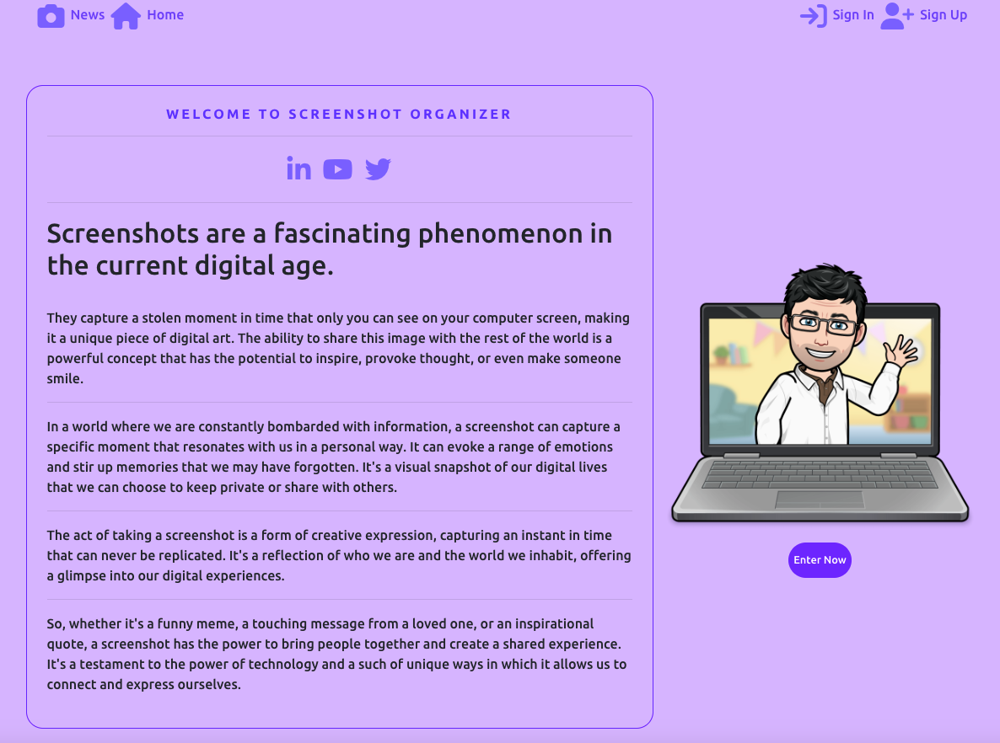

| Story | action required | Checked? |
|:-------:|:--------|:--------|
| As a Unlogged User | I can have access to all new screenshot published by users from the app | &check; |


On clicking on the top-menu button called "News", Unlogged user can have a view of all published Public screenshots of the app.

| Story | action required | Checked? |
|:-------:|:--------|:--------|
| As a Site User | I can Register as a new user of the App. If already registered, I can log in and log out | &check; |

On clicking on the top-menu button named "Sign In", an Unlogged user can sign in with username and password.
When username and password are confirmed, the News page is loaded and the user can have full access of the app.


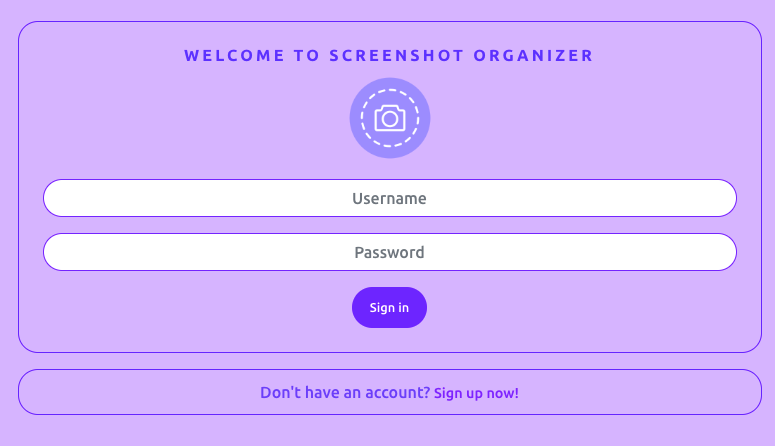

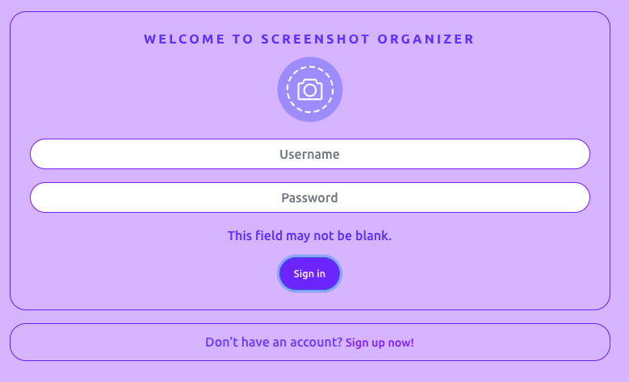

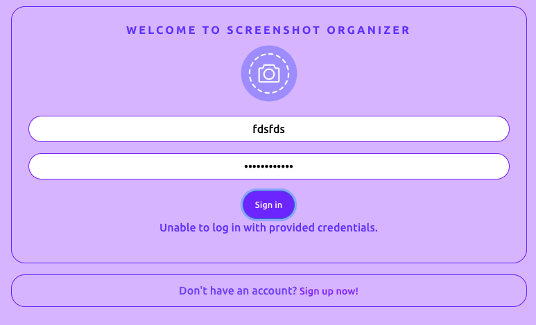


| Story | action required | Checked? |
|:-------:|:--------|:--------|
| As a Site User | I can edit my profile as Avatar, Username or password | &check; |

On clicking on my avatar on the top menu, User will display a profile details. A dropdown button will show up some options :
- Edit Profile
- Change Username
- Change password


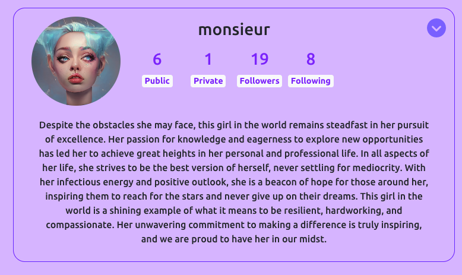

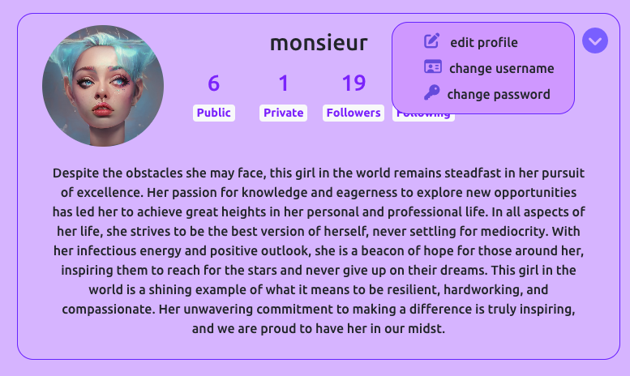

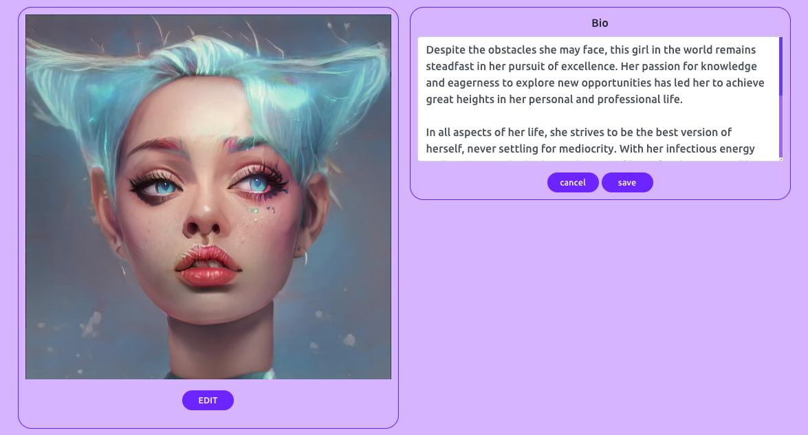


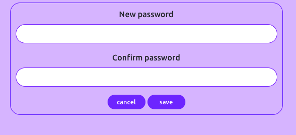

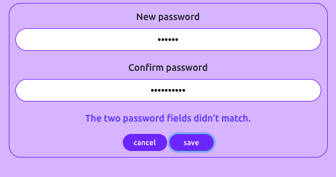

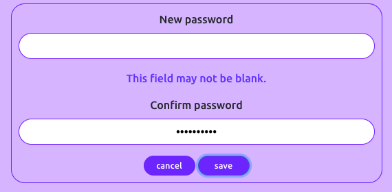

| Story | action required | Checked? |
|:-------:|:--------|:--------|
| As a Site User | I can see other user's profiles | &check; |

As a User, I can have a view of all users profiles registered on the app by just clicking on their avatar or username.


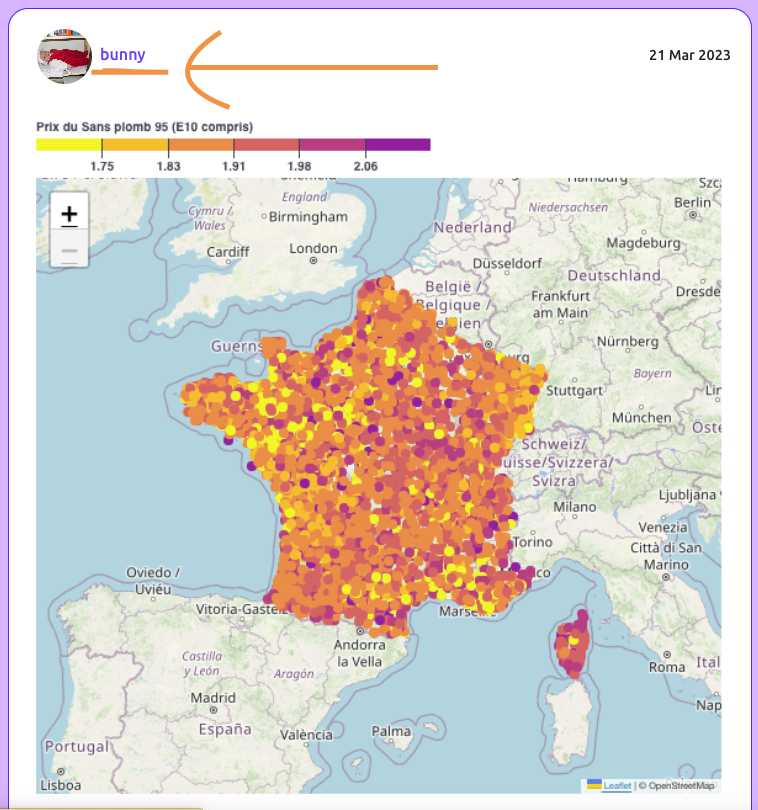

| Story | action required | Checked? |
|:-------:|:--------|:--------|
| As a Site User | I can follow or Unfollow other Users | &check; |

There is only 2 ways to follow or unfollow an other user. 
- Clicking on the button follow/unfollow from the right-menu 

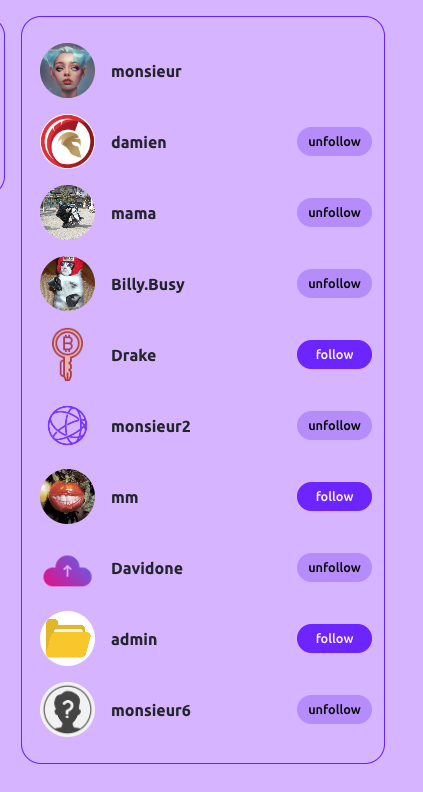

- Clicking on the button follow/unfollow from the User Profile


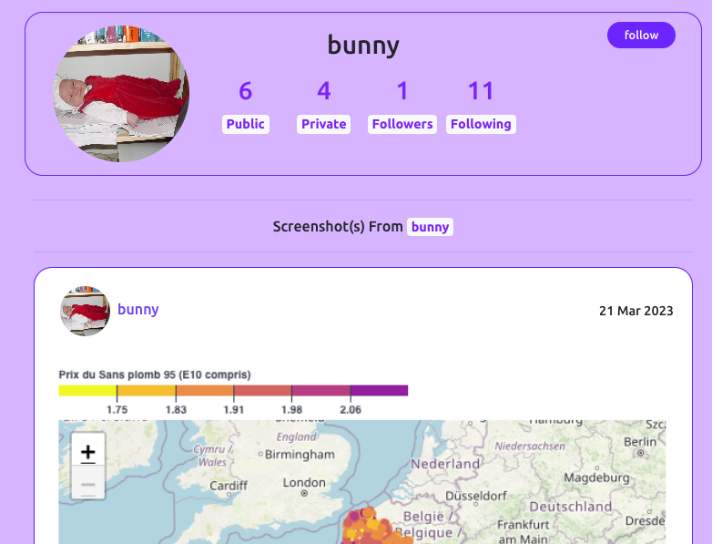

| Story | action required | Checked? |
|:-------:|:--------|:--------|
| As a Site User | I can see information about how many followers I have, how many Users I follow, how many Private and Public screenshot I published | &check; |

As a User, I can have a general view of my activity on the app within the profile area.


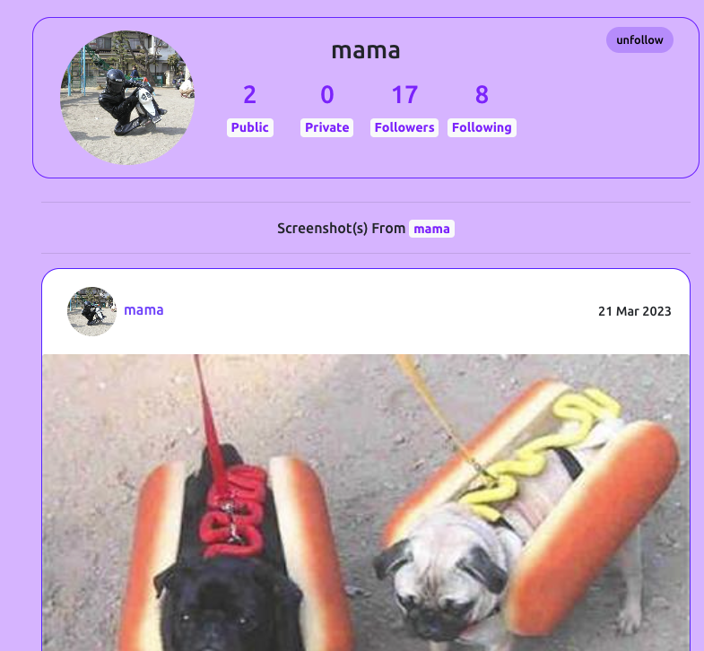


| Story | action required | Checked? |
|:-------:|:--------|:--------|
| As a Site User | I can like or comment a screenshot from other users | &check; |

it does not matter what page the user is visiting between News, Community or Favorites, The User can Like or Unlike any public screenshots by clicking on the Like Icon . 

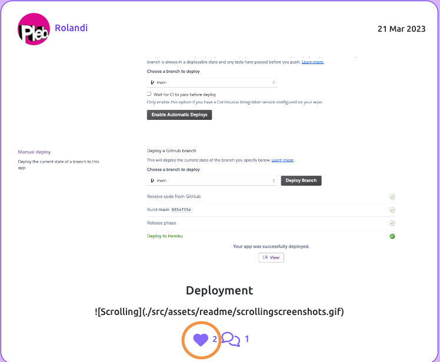


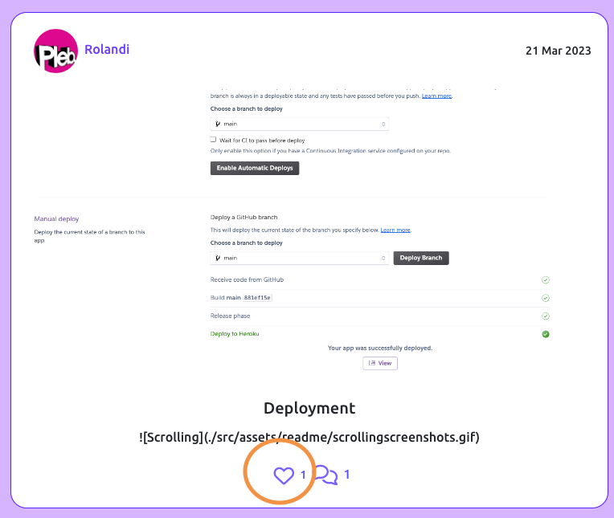

Of course, if User is the owner of the public screenshot, it will show up a message that it's not permitted!

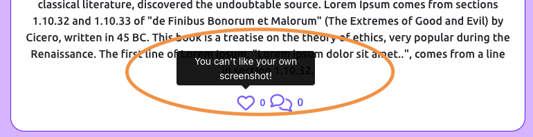

```
is_owner ? (
  <OverlayTrigger
    placement="top"
    overlay={<Tooltip>You can't like your own screenshot!</Tooltip>}
  >
    <i className="far fa-heart" />
  </OverlayTrigger>
)
```

| Story | action required | Checked? |
|:-------:|:--------|:--------|
| As a Site User | I have a direct access to all the screenshots I liked from other Users | &check; |

The top-menu button "Favorites" give access to all Liked screenshots by the User. This is a good way to keep track on screenshot that User want to use in a near future and find it easily.


| Story | action required | Checked? |
|:-------:|:--------|:--------|
| As a Site User | I have direct access to all screenshots from all the followed Users I am following | &check; |

The top-menu button "Community" give access to all screenshots from all followed Users of the App. That a good way to read only Users that you followed and selected as a quality User and only content from mthem will appears in this section.

| Story | action required | Checked? |
|:-------:|:--------|:--------|
| As a Site User | I have a direct access to All the new Public screenshots published on the app organized by date | &check; |

The top-menu button "News" give access to all screenshots from all Users of the App organized by date, that's means the latest will appear first.


| Story | action required | Checked? |
|:-------:|:--------|:--------|
| As a Site User | I can search for a specific screenshot or a User in 3 differents areas : favorites, Community and News| &check; |


| Story | action required | Checked? |
|:-------:|:--------|:--------|
| As a Site User | I have a direct access to all most followed Users of the app | &check; |

The right menu is displaying the 10 most followed Users of the App. This menu is visible when User is interacting with Public area. 

| Story | action required | Checked? |
|:-------:|:--------|:--------|
| As a Site User | I can Unlike a Public Screenshot from other User | &check; |

Each Public screenshot have a dedicated area for Likes simbolized by a Heart icon. Clicking on it will have Like or Unlike the screenshot depending the previous status.


| Story | action required | Checked? |
|:-------:|:--------|:--------|
| As a Site User | I can comment other Public screenshot and also my own Public screenshot.| &check; |

Adding a new comment to any Public screenshot is available as long as the User is connected. Each public screenshot have a dedicated area to add a new comment by clicking on the Comment icon.

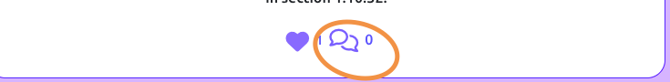

| Story | action required | Checked? |
|:-------:|:--------|:--------|
| As a Site User | I can edit my comments at any time and the updated comment is published right away. | &check; |

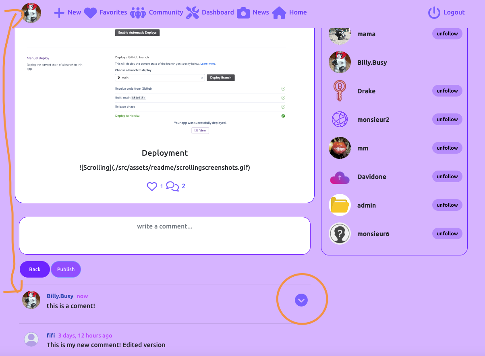

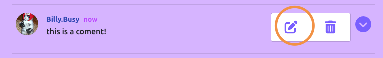

| Story | action required | Checked? |
|:-------:|:--------|:--------|
| As a Site User | I can delete a comment I made on a Public screenshot.| &check; |


| Story | action required | Checked? |
|:-------:|:--------|:--------|
| As a Site User | I can have access to a page dedicated for adding new content : Public screenshot, Private screenshot or a new category | &check; |

My first idea was to have access from NavBar the following buttons :
* Add aa Private Screenshot
* Add a Public Screenshot
* Add a New category

But then it was to much icons on the navbar and it loook confusing.
That's why I decided to create a dedicated page for that to also give an oportunity to add some text which explain the difference between all thoses 3 choices.

Initially, I planned to include the "Add a Private Screenshot", "Add a Public Screenshot", and "Add a New Category" buttons in the NavBar. However, I found that this made the NavBar cluttered and confusing. To address this, I opted to create a separate page that allow adding some texts explaining the distinctions between these three options, while also reducing the number of icons on the NavBar.

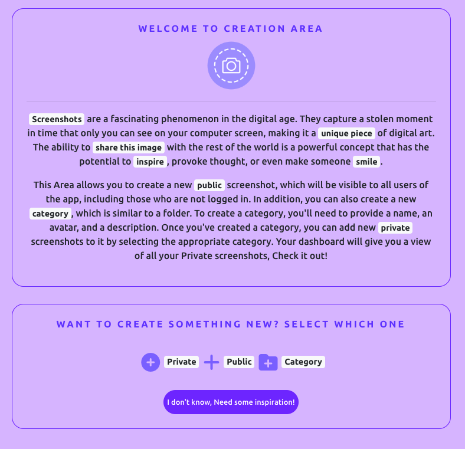

| Story | action required | Checked? |
|:-------:|:--------|:--------|
| As a Site User | I can add a new category, it's a folder-like feature to help organizing private screenshots | &check; |

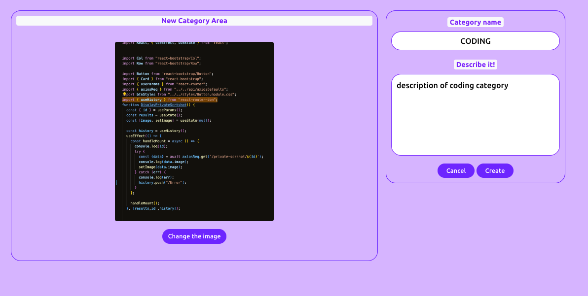

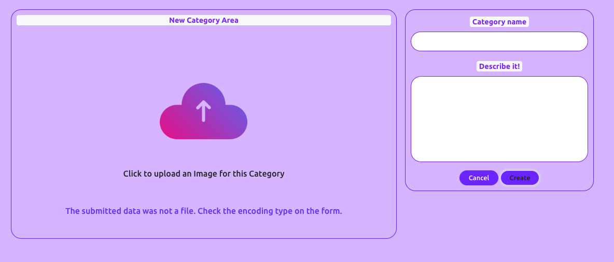


Users have the ability to create multiple categories at their discretion. If the user only fills in the avatar field when creating a new category, a category called "Main" with an empty description will be created. Both the category name and description can be edited at any time after creation.

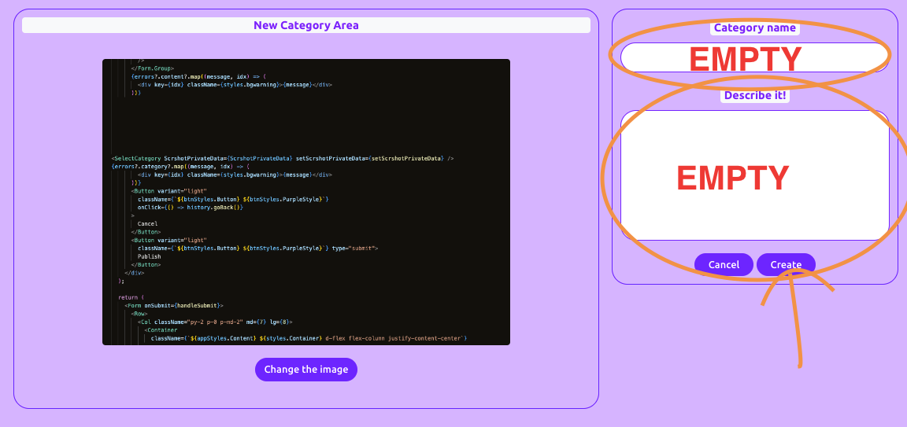

It is important to consider future updates to the app during development. For example, in the future, it may be possible for a user to share one of their categories (including its contents) with another user (see [share category](<#share-category>)). To anticipate this feature, I have allowed the possibility of a user sharing a folder named "WORK" with another user who also has a category named "WORK". To avoid issues in the future, I have decided not to enforce a unique category name requirement. Instead, it will be the user's responsibility to differentiate between categories using their respective avatars. Additionally, users can rename their categories as many times as they wish.

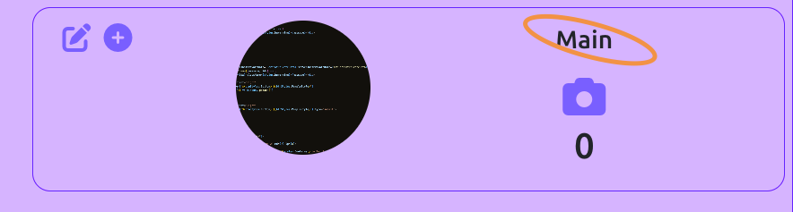

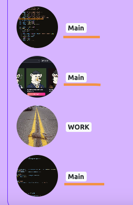


| Story | action required | Checked? |
|:-------:|:--------|:--------|
| As a Site User |  I can add a new Private screenshot, I can choose on same page into which category it will be added | &check; |

To add a Private screenshot, it's required to select the category it will be connected to. This is part of the concept of this app, so User define category name and description and can add new private screenshot into it. User can add as much screenshots as they want to into each category. No limits.

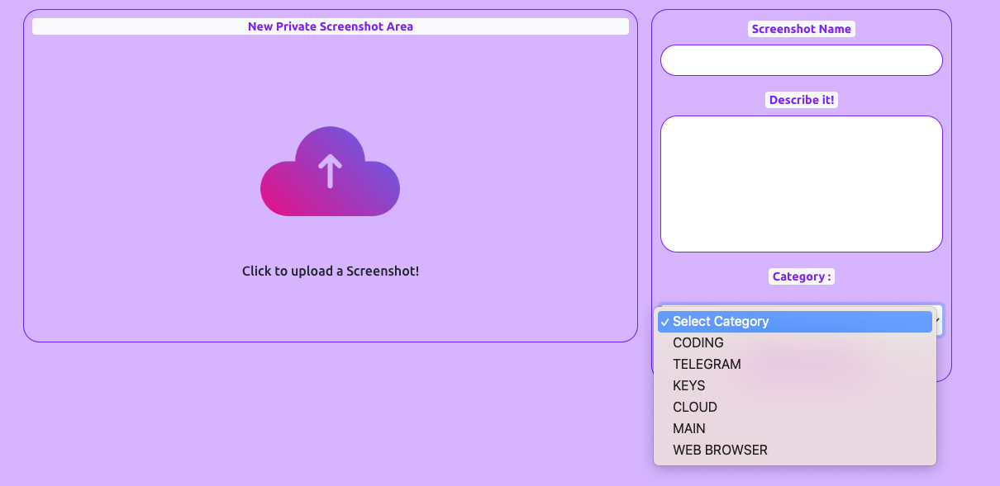

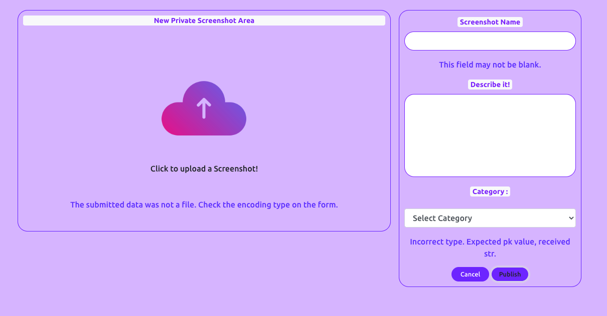

I created this ```<SELECT>``` list of category as an external component from the Private screenshot creation page. So in the future it will be possible to display this list somewhere else on the app if needed.


| Story | action required | Checked? |
|:-------:|:--------|:--------|
| As a Site User | I can add a new Public screenshot and publish it so anybody on the app, even unlogged user can see it. | &check; |

As a Logged User, I can create a new Public screenshot. I just need to fill up the form with an image, a name and a description, That's all!


After submitting User will be redirected to the published screenshots where he can :
- Delete it
- Edit it
- Add a comment

| Story | action required | Checked? |
|:-------:|:--------|:--------|
| As a Site User | I can have access to a Dashboard where i can see all my category folders and all my private Screenshot | &check; |

On clicking of thisNavbar button called Dashboard, User directly access to all Private screenshots published on the app ordered by date (newest is first to display). 
On the right side, a new menu appears, its the list of the 10 most used category from the user. To see all the category created by the user, there is a dropdown Menu on the top right of the category window which allow user to :
- See all category
- See all private screenshots
- Search category
- Delete category

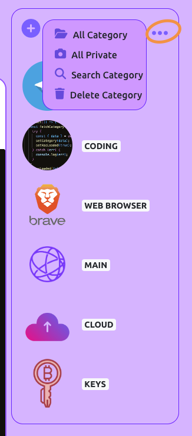


| Story | action required | Checked? |
|:-------:|:--------|:--------|
| As a Site User | I can add new category, update category and delete category. At least one category should remain for adding Screenshot as a requirement | &check; |

The process of adding a new category should be easily accessible and straightforward, with the option available from multiple locations within the app. One way to access the category creation feature is by clicking the "New" button on the Navbar, which leads to a dedicated page for selecting and adding a new category. However, there are other ways to access this feature as well, such as through buttons integrated into the dashboard or the category listing page, which enable users to create a new category with just one click.

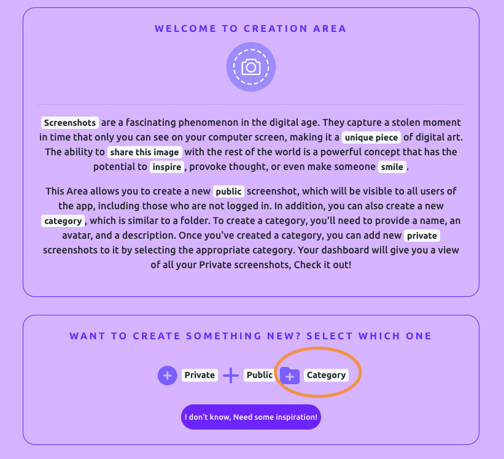

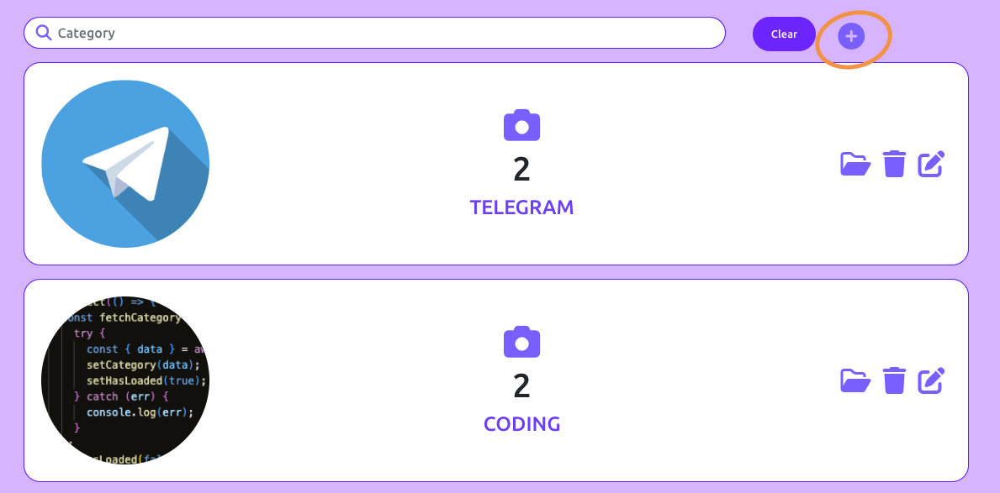

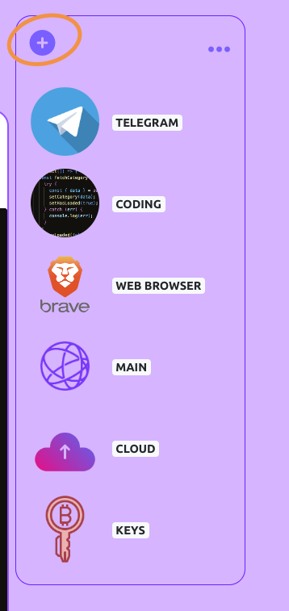


Once created, a category can be edited with a new title and description or a new avatar. 
Also, a category can be deleted at any moment. Be careful! All screenshots inside the category will be deleted also. 


| Story | action required | Checked? |
|:-------:|:--------|:--------|
| As a Site User | I can add new private screenshot, update it, delete it | &check; |

As a registered user, I have multiple options to add a new private screenshot. Firstly, I can click on the "New" button located on the navbar menu, which will redirect me to a page where I can choose to upload a new private screenshot. Additionally, if I enter a specific category from the right menu, it will display all the private screenshots in that category, along with an option to add a new private screenshot accessible via a button on the top-left.

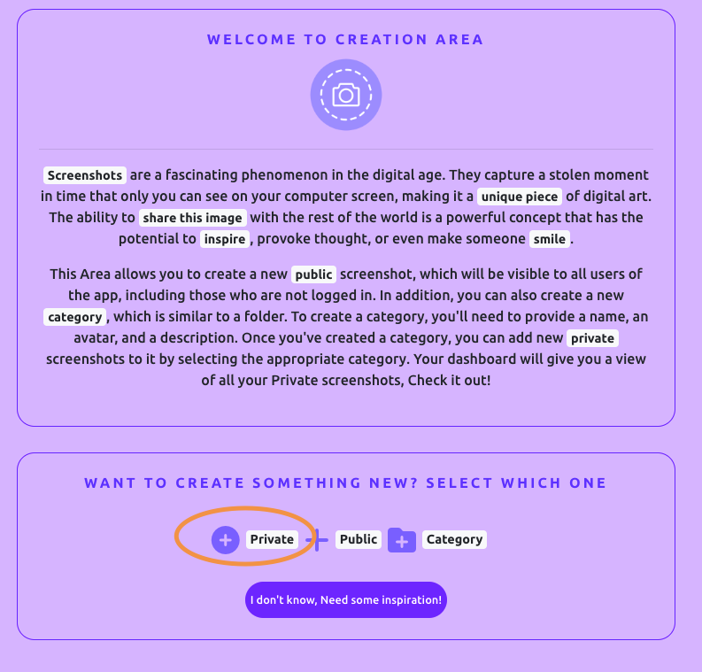

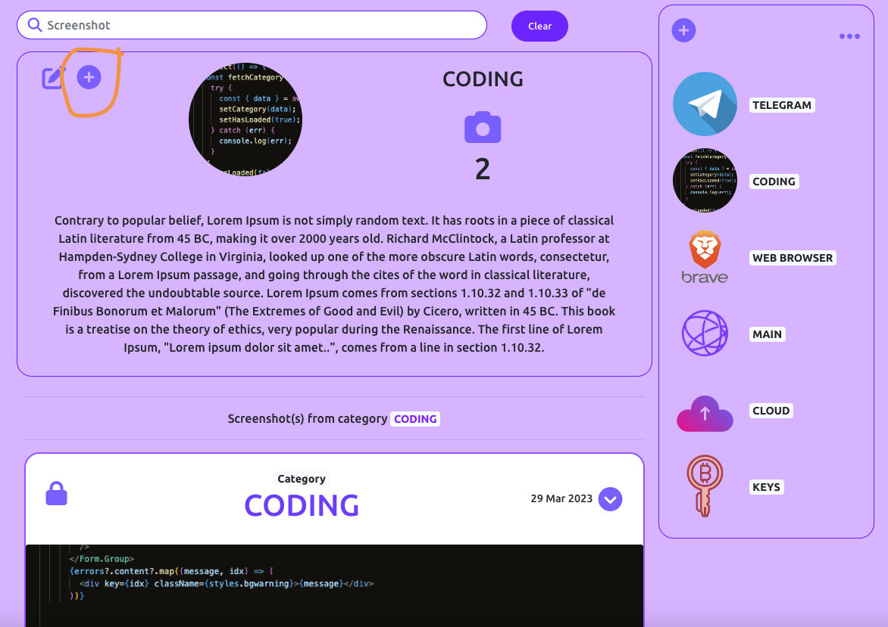


Once into the new private screenshot creation page, User need to fill in : 
- an image
- a name
- a description
- selected category


Once created, a private screenshot can be deleted or edited by clicking on the appropriate button as following :

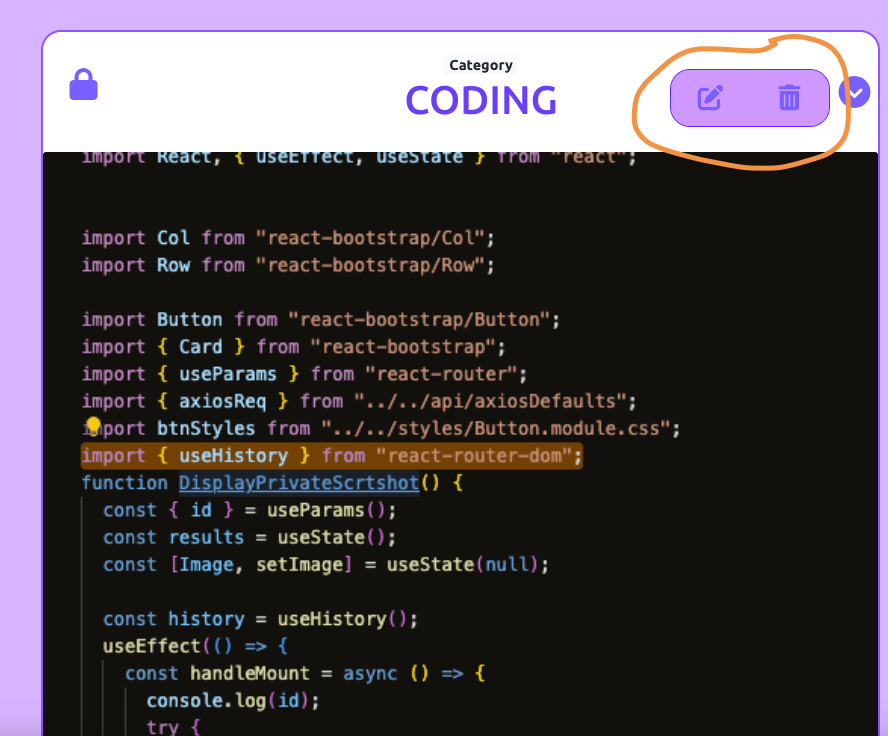


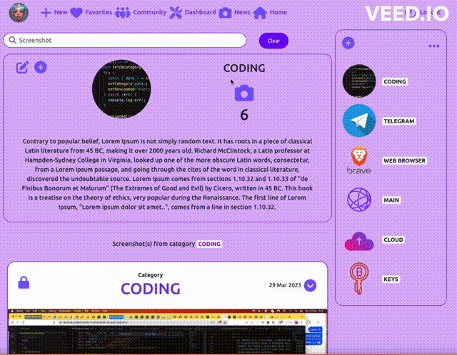


| Story | action required | Checked? |
|:-------:|:--------|:--------|
| As a Site User | I can add a new Public Screenshot, update it and delete it. | &check; |

As a registered user, I can click on the "New" button located on the navbar menu, which will redirect me to a page where I can choose to upload a new public screenshot.

Once created, a public screenshot can be deleted or edited by clicking on the appropriate button as following :

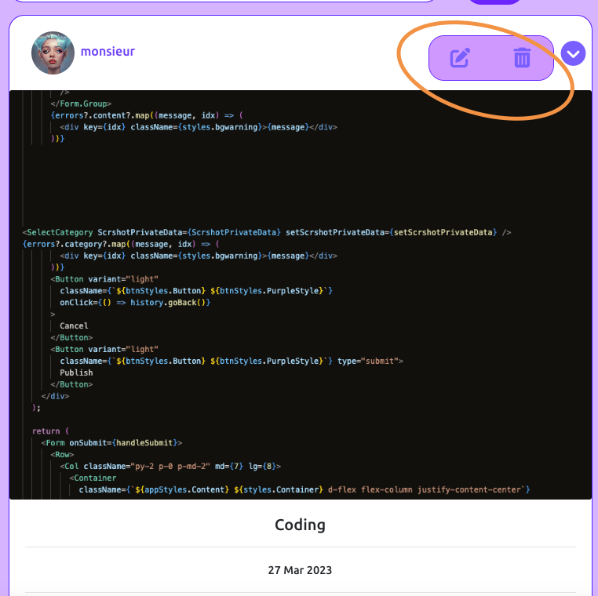


| Story | action required | Checked? |
|:-------:|:--------|:--------|
| As a Site User | I can search to any key words into category and Private screenshot| &check; |

The user has the ability to search for a particular screenshot by entering keywords found in the title or description. To search within a specific category, the user can select the desired category from the menu on the right-hand side, which will then prompt a search bar to appear for conducting a search within that category. If the user selects the option to display all private screenshots by clicking on the dashboard button, the search will encompass all private screenshots registered by that user.

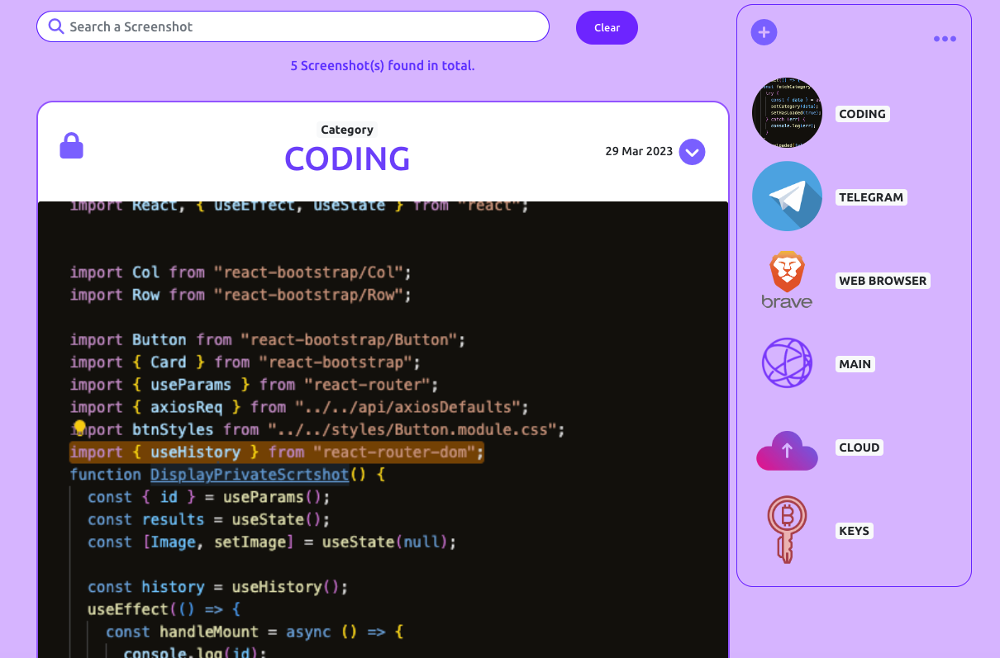


| Story | action required | Checked? |
|:-------:|:--------|:--------|
| As a Site User | I can access to a dedicated page to see all my category folder and see avatar of each and how much screenshots are published inside | &check; |

Each category have a dedicated page to display all information about this category, description, avatar, title name but also number of screenshots inside this category

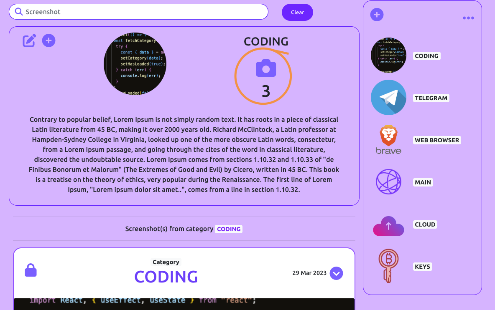


| Story | action required | Checked? |
|:-------:|:--------|:--------|
| As a Site User | I have a fluent navigation within cancel button, Back button or dropdownMenu for quick selection | &check; |

The user's navigation experience should be seamless and uninterrupted, with no frustrating moments that require them to use the web browser's back button. To achieve this, I have implemented a logical strategy that always presents the user with a double choice: they can continue with their current action or cancel it and go back. Additionally, a NavBar is always present at the top of the website, providing easy access to the main parts of the application. Dropdown menus have also been included to allow users to choose from various alternatives related to a specific point as category or profile.


| Story | action required | Checked? |
|:-------:|:--------|:--------|
| As a Site User | I can see a dedicated page 404 when URL incoporated is wrong and I have access to a button to get me back safe to the app| &check; |

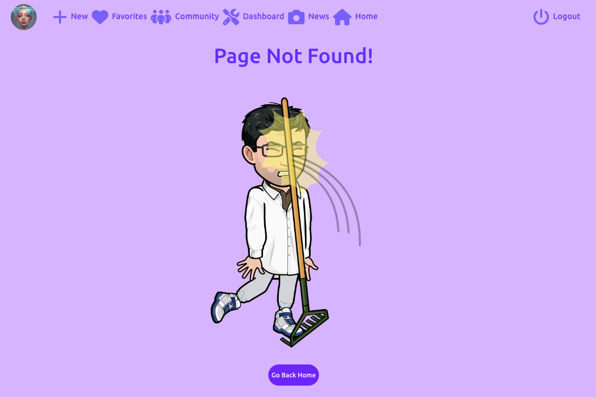


[Back to top](<#contents>)


## Validator HTML CSS JAVASCRIPT

  ### HTML

  The [HTML Validator](https://validator.w3.org/) result is the following :


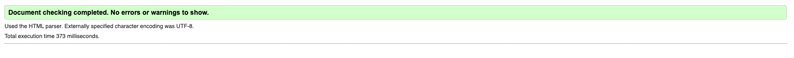

  ### CSS


  The [CSS Validator](https://jigsaw.w3.org/css-validator/) result is the following:

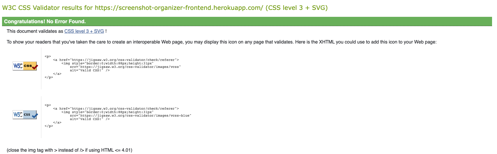


## Lighthouse

the  [Lighthouse Testing](https://pagespeed.web.dev/)  gives the following results :

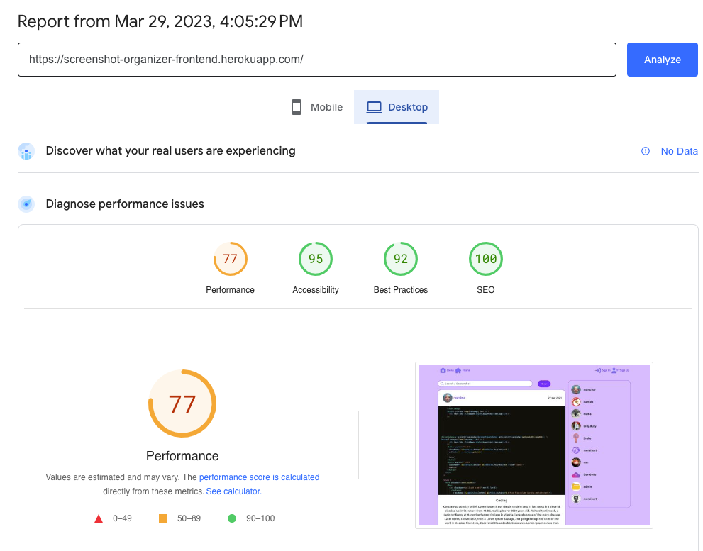

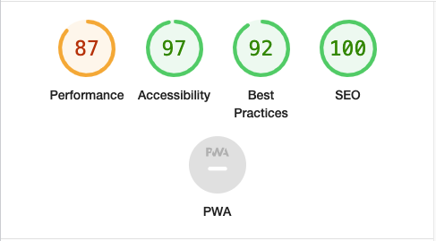

The Lighthouse report for my app indicates that achieving optimal performance is a challenge (specially on mobile phone devices), as the app primarily deals with displaying images.

## Color Contrast Accessibility Validator

The [Color and contrast testing](https://color.a11y.com/Contrast/) website gives the following result :


## Browser Testing

To ensure that the website was responsive across various screen sizes in both portrait and landscape mode, it was viewed on a range of devices including desktops, laptops, iPhone 12 pro, iPhone XR, and iPads. The website performed as intended and its responsiveness was confirmed using Chrome developer tools on multiple devices.

### Responsiveness Test

The responsive design tests have been tested manually with [Google Chrome DevTools](https://developer.chrome.com/).

| Desktop| Display <1280px | Display >1280px | landscape mode | portrait |
|:-------:|:--------|:--------|:--------|:--------|
| Display | &check; | &check; | &check; | &check; |


| Tablet | Surface Pro 7 | Nest Hub | iPAD Mini | iPad Air | landscape mode | portrait |
|:-------:|:--------|:--------|:--------|:--------|:--------|:--------|
| Display | &check; | &check; | &check; | &check; |&check; | &check; |

| Phone | Galaxy Galaxy S8+ | Iphone 12 Pro | Iphone SE | Iphone XR |
|:-------:|:--------|:--------|:--------|:--------|
| Display | &check; | &check; | &check; | &check; |

[Back to top](<#contents>)

The NavBar is also responsive to different screen size :

1. On small devices :

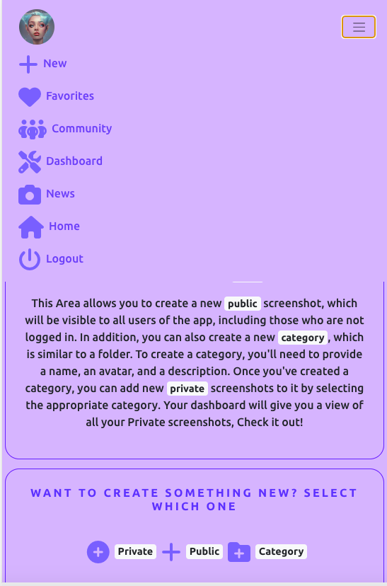

2. Big screen devices

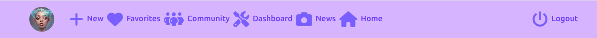


[Back to top](<#contents>)


### Browser Compatibility

* Google Chrome Version
* Mozilla Firefox 
* Opera Crypto

[Back to top](<#contents>)


### Manual Testing


## Site Navigation

Let's explore how to navigate the App and gain a comprehensive understanding of the available buttons, potential actions, and additional features.

* HOME PAGE 

| Element | Action | Result | Checked? |
|:-------:|:--------|:--------|:--------|
| Button "Enter Now" | Click | Redirect to News section where all public screenshots are displayed  | &check; |
| Button "Sign In" | Click | Redirect to Sign In Page  | &check; |
| Button "Sign up" | Click | Redirect to Sign up Page  | &check; |
| Button "Sign up" | Click | Redirect to Sign up Page  | &check; |
| Button "News" | Click | Redirect to News section where all public screenshots are displayed   | &check; |
| Button "Social media" | Click | Open a new tab with the selected social media website  | &check; |

* SIGN IN

| Element | Action | Result | Checked? |
|:-------:|:--------|:--------|:--------|
| Button "Sign in" | Click | If form filled correctly, redirection to News section but with full acess menu  | &check; |
| Button "Sign up Now" | Click | Redirect to Sign Up Page  | &check; |


* SIGN UP

| Element | Action | Result | Checked? |
|:-------:|:--------|:--------|:--------|
| Button "Sign up" | Click | If form filled correctly, redirection to Sign in Page | &check; |
| Button "Already have an account? sign in" | Click | Redirect to Sign In Page  | &check; |


* + NEW

| Element | Action | Result | Checked? |
|:-------:|:--------|:--------|:--------|
| Button "Private" | Click | Redirect to Private screenshot creation page | &check; |
| Button "Public" | Click | Redirect to Public screenshot creation page | &check; |
| Button "category" | Click | Redirect to category creation page | &check; |


* Favorites, Community and News

| Element | Action | Result | Checked? |
|:-------:|:--------|:--------|:--------|
| Button "Unfollow" if active | Click | Will unfollow the selected user | &check; |
| Button "Follow" if active | Click | Will follow the selected user | &check; |
| Button "comment" from a displayed screenshot | Click | Redirect to comment page | &check; |
| Button "Likes" from a displayed screenshot | Click | Will add 1 Likes to selected screenshot (if owner of the screenshot, no action will be executed) | &check; |
| Button "Clear" from the search input | Click | If search input is empty nothing happpen, if not, will be erase and page is reloading | &check; |

* Dashboard

| Element | Action | Result | Checked? |
|:-------:|:--------|:--------|:--------|
| Button "Add a new category" from right-side menu | Click | Redirect to add category page | &check; |
| Button "..." from right-side menu | Click | Will open a dropdown Menu with some options around category and screenshots | &check; |
| Button "Clear" from the search input | Click | If search input is empty nothing happpen, if not, will be erase and page is reloading | &check; |

* Category Listing Page

| Element | Action | Result | Checked? |
|:-------:|:--------|:--------|:--------|
| Button "Add a new category" from top menu | Click | Redirect to add category page | &check; |
| Button "Clear" from the search input | Click | If search input is empty nothing happpen, if not, will be erase and page is reloading | &check; |
| Button Icon "Folder" from a category | Click | redirect to the selected category page | &check; |
| Button Icon "Trash" from a category | Click | Will delete the selected Category | &check; |
| Button Icon "Edit" from a category | Click | Will redirect to selected Category edition page | &check; |

* Selected Category Page

| Element | Action | Result | Checked? |
|:-------:|:--------|:--------|:--------|
| Button "Add a new screenshot" from top left menu | Click | Redirect to add screenshot private page | &check; |
| Button "Clear" from the search input | Click | If search input is empty nothing happpen, if not, will be erase and page is reloading | &check; |
| Button Icon "Edit" from a category | Click | Will redirect to selected Category edition page | &check; |


* New Category Page

| Element | Action | Result | Checked? |
|:-------:|:--------|:--------|:--------|
| Button "Cancel"  | Click | Redirect to the last page visited | &check; |
| Button "Create"  | Click | If Form is filled correctly it willl redirect to Category section displaying the fresh category just created | &check; |


* New Private screenshot Page

| Element | Action | Result | Checked? |
|:-------:|:--------|:--------|:--------|
| Button "Cancel"  | Click | Redirect to the last page visited | &check; |
| Button "Publish"  | Click | If Form is filled correctly it willl redirect to Private Screenshot section | &check; |

* New Public screenshot Page

| Element | Action | Result | Checked? |
|:-------:|:--------|:--------|:--------|
| Button "Cancel"  | Click | Redirect to the last page visited | &check; |
| Button "Publish"  | Click | If Form is filled correctly it willl redirect to News section | &check; |

* User Profile Page

| Element | Action | Result | Checked? |
|:-------:|:--------|:--------|:--------|
| Button "DropDownMenu" from top-right  | Click | Will show up 3 choices : change username, edit profile and change password | &check; |


* Additional buttons

| Element | Action | Result | Checked? |
|:-------:|:--------|:--------|:--------|
| Button "Logout"  | Click | Redirect to News section of the app and the User will be disconnect from the App | &check; |


[Back to top](<#contents>)


## Manual Testing

In order to maintain the coherence of the application and prevent scenarios where disconnected or regular users are able to carry out unauthorized actions, I conduct a comprehensive manual testing of the entire app.

**As a Not connected User**

| Action | Result  | Checked? |
|:-------:|:--------|:--------|
| Type incorrect URL on the browser | Typing an incorrect URL on the browser will result a 404 error | &check; |
| Type users URL to access User profile profiles/3 | Display the selected profile but with no access to edition menu | &check; |
| Type users URL to access Dashboard /ListScrshotPrivatePage |  Redirected to News Page | &check; |
| Type users URL to access category details /category/149 |  Redirected to error page 404 | &check; |
| Type users URL to access private screenshots details /scrshot_private/213 |  Redirected to error page 404 | &check; |
| Type users URL to access All category Page /ListAllCategoryPage |  Redirected to error page 404 | &check; |
| Type users URL to access the form to create a new screenshot private /scrshot_private/create |  Redirected to error page 404 | &check; |
| Type users URL to access orm to create a new public screenshot /scrshot_public/create |  Redirected to News Page | &check; |
| Type users URL to access orm to create a new Category /category/create |  Redirected to News Page | &check; |

**As a connected User but not owner of the content**

| Type users URL to access User profile profiles/3 | Display the selected profile but with no access to edition menu | &check; |
| Type users URL to access category details /category/149 |  Redirected to error page 404 | &check; |
| Type users URL to access private screenshots details /scrshot_private/213 |  Redirected to error page 404 | &check; |


[Back to top](<#contents>)


## Form Validation

**About the New Category Form**

To be able to create a new Category, we only need 1 required input to be valid :
* The Category avatar image

if only avatar image is given then the new category will have the title as "Main" with no description. User can edit it at anytime.

All scenarios where one of thoses inputs are not valid have been tested :
- only blank space introduced : may not be blank
- one blank spance introduce + legit character : blank space will be deleted automatically
- Javascript tag introduced into input like <script>alert('bomb')</script> : script will not be executed on the app when displayed

Note: The same test have been executed to Edit Category Form.

**About the New Private Screenshot Form**

To be able to create a new Private screenshot, we only need 3 required input to be valid :
* The Screenshot image
* The Name of the screenshot
* The category 


All scenarios where one of thoses inputs are not valid have been tested :
- only blank space introduced : may not be blank
- one blank spance introduce + legit character : blank space will be deleted automatically
- Javascript tag introduced into input like <script>alert('bomb')</script> : script will not be executed on the app when displayed

Note: The same test have been executed to Edit Private screenshot Form.

**About the New Public Screenshot Form**

To be able to create a new Public screenshot, we only need 2 required input to be valid :
* The Screenshot image
* The Name of the screenshot


All scenarios where one of thoses inputs are not valid have been tested :
- only blank space introduced : may not be blank
- one blank spance introduce + legit character : blank space will be deleted automatically
- Javascript tag introduced into input like <script>alert('bomb')</script> : script will not be executed on the app when displayed

Note: The same test have been executed to Edit Public screenshot Form.


[Back to top](<#contents>)

## Error pages

Custom Error Pages were designed to enhance the user's experience by providing them with additional details about the error encountered and offering helpful buttons to navigate them back to the website.

For security purpose, All errors have been treated as a 404 error when is about displaying the error to the User. In fact, an 403 Access forbiden can give a critical details to the user meaning that it confirm that the data is existing but with no access, thats means the user can try to reach this data within an other way. Displaying 404 all errors are treated as not existing which give no extra information to the user.


```
try {
const [{ data: category }, { data: scrshots }] = await Promise.all([
  axiosReq.get(`/category/`),
  axiosReq.get(`/private-scrshot/?${filter}search=${query}`)
]);
} catch (err) {
history.push("/Error");
}
```

The page /Error is not existing on the App so it will automatically display the 404 errors :-D


[Back to top](<#contents>)


## Bugs

### Fixed Bugs

Selection of which category :
When 

[Back to top](<#contents>)


### UnFixed Bugs

I don't known if this is an unfixed bug but i didn't known where to put the following :

some days before I submit my project, i got an email :


I don't understand because i didn't touch or update or remove or edit this file since very first initial deployment as I known how important the first commit with this sensitive file. So, been asking on Slack and Gitguardian showing no secrets incident on the main dashboard of my profile make me feel safe, but still, i would like to understand...

Execpt that, there is no unfixed bugs
